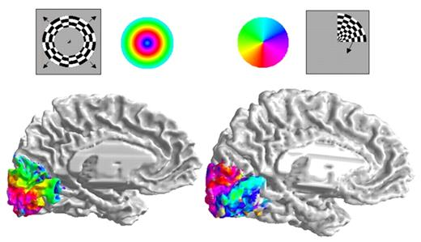

## Prelude {.smaller}

<iframe width="560" height="315" src="https://www.youtube.com/embed/Zdgw4S0GgL8" frameborder="0" allowfullscreen></iframe>

[[@han_integrated_2017]](http://doi.org/10.1016/j.cell.2016.12.027)

## Today's topics

- Warm-up
- Wrap-up on structural measures
- Functional measures

# Warm-up

## This cell-staining technique has what kind of *spatial* resolution?

## This cell-staining technique has what kind of *spatial* resolution?

- High/resolves fine details
- Low/resolves crude details

## This cell-staining technique has what kind of *spatial* resolution?

- **High/resolves fine details**
- ~~Low/resolves crude details~~

## This cell-staining technique has what kind of *temporal* resolution?

## This cell-staining technique has what kind of *temporal* resolution?

- High/resolves fine details or quickly changing phenomena
- Low/resolves crude details or slowly changing phenomena

## This cell-staining technique has what kind of *temporal* resolution?

- ~~High/resolves fine details or quickly changing phenomena~~
- **Low/resolves crude details or slowly changing phenomena**

## Anterograde tracing chemicals are injected in brain tissue in order to answer what question?

- A. What kinds of cells are prominent in a given area?
- B. The density of dendrites and axons in a given region?
- C. Where does a target region project to or get input from?

## Anterograde tracing chemicals are injected in brain tissue in order to answer what question?

- ~~A. What kinds of cells are prominent in a given area?~~
- ~~B. The density of dendrites and axons in a given region?~~
- **C. Where does a target region project to or get input from?**

# Wrap-up on structural measures

## [Magnetic Resonance Imaging (MRI)](https://en.wikipedia.org/wiki/Magnetic_resonance_imaging)

- Magnetic resonance
- Some common isotopes (e.g., H) & complex molecules have a magnetic dipole
- Axes align with strong magnetic field
- When alignment perturbed by radio frequency (RF) pulse, speed of realignment varies by tissue
- Realignment emits RF signals

## MRI {.smaller}

<http://s.hswstatic.com/gif/mri-steps.jpg>

## How MRI works

<iframe width="560" height="315" src="https://www.youtube.com/embed/1CGzk-nV06g" frameborder="0" allowfullscreen></iframe>

## Structural MRI

- Reveals tissue density/type differences
- [Gray matter](https://en.wikipedia.org/wiki/Grey_matter) (neurons & dendrites & axons & glia) vs. [white matter](https://en.wikipedia.org/wiki/White_matter) (mostly axons)
- MR Spectroscopy
- Region sizes/volumes

## Structural MRI of the brain

## [Diffusion tensor imaging (DTI)](https://en.wikipedia.org/wiki/Diffusion_MRI#Diffusion_tensor_imaging)

## [Diffusion tensor imaging (DTI)](https://en.wikipedia.org/wiki/Diffusion_MRI#Diffusion_tensor_imaging)

- Type of structural MRI
- Reveals integrity/density of *axon fibers*
- Measure of connectivity between brain areas
- (Colors indicate closest-matching 'direction')

## [Voxel-based morphometry (VBM)](https://en.wikipedia.org/wiki/Voxel-based_morphometry)

- [Voxels (volume-based elements)](https://en.wikipedia.org/wiki/Voxel)
- Morphometry, measure ("metry") form/morphology.
- How does brain size or thickness vary by age, disease status, etc.?

## Voxel-based morphometry {.smaller}

<http://www.frontiersin.org/files/Articles/18691/fnhum-06-00184-HTML/image_m/fnhum-06-00184-g003.jpg>

## Colors mean *size* differences

# Functional methods

## Functional methods

- Recording from the brain 
- Interfering with the brain 
- Stimulating the brain
- Simulating the brain

## Recording from the brain

- Single/multi unit recording
    - Microelectrodes
    - Small numbers of nerve cells

## Single/multi-unit Recording {.smaller}

<http://www.nature.com/nrn/journal/v5/n11/images/nrn1535-i1.jpg>

## Single/multi-unit recording

- What does neuron X respond to?
- High temporal (ms) & spatial resolution (um)
- Invasive
- Rarely suitable for humans, but...

## [Electrocorticography (ECoG)](https://en.wikipedia.org/wiki/Electrocorticography)

---- 

<iframe width="560" height="315" src="https://www.youtube.com/embed/HluVToAamXY" frameborder="0" allowfullscreen></iframe>

Story about child who underwent ECoG surgery.

## [Positron Emission Tomography (PET)](https://en.wikipedia.org/wiki/Positron_emission_tomography)

<iframe width="560" height="315" src="https://www.youtube.com/embed/GHLBcCv4rqk" frameborder="0" allowfullscreen></iframe>

## [Positron Emission Tomography (PET)](https://en.wikipedia.org/wiki/Positron_emission_tomography)

- Radioactive tracers (glucose, oxygen)
- Positron decay
- Experimental condition - control
- Average across individuals

---

PET can be used to look at differences in brain activation in different, but related tasks.

---

PET can be used to compare changes in brain metabolism at baseline, across tasks.

## Evaluating PET

+ Temporal (~ s) and spatial (mm-cm) resolution *worse* than fMRI
+ Radioactive exposures + mildly invasive 
+ Dose < airline crew exposure in 1 yr

## [Functional Magnetic Resonance Imaging (fMRI)](https://en.wikipedia.org/wiki/Functional_magnetic_resonance_imaging)

- Neural activity -> local $O_2$ consumption increase
- *Blood Oxygen Level Dependent (BOLD) response*
    + Oxygenated vs. deoxygenated hemoglobin creates magnetic contrast
    + Do regional blood $O_2$ volumes (and flow) vary with behavior X?
    
## fMRI

## fMRI [[@dougherty_visual_2003]](http://doi.org/10.1167/3.10.1)

## Evaluating fMRI

+ Non-invasive, but expensive
+ Moderate but improving (mm) spatial, temporal (~sec) resolution
+ **Indirect** measure of brain activity
- [Hemodynamic Response](https://en.wikipedia.org/wiki/Haemodynamic_response) Function (HRF)
    + 1s delay plus 3-6 s ramp-up

## [Hemodynamic Response](https://en.wikipedia.org/wiki/Haemodynamic_response) Function (HRF)

## [Electroencephalography (EEG)](https://en.wikipedia.org/wiki/Electroencephalography)

- How does it work?
    - Electrodes on scalp or brain surface
- What do we measure?
    - Combined activity of huge # of neurons

## EEG

## EEG

- High temporal but poor spatial resolution
- Analyze frequency bands
    + LOW: deep sleep
    + MIDDLE: Quiet, alert state
    + HIGH:“Binding” information across senses
  
## EEG Frequency

## [Event-related potentials (ERPs)](https://en.wikipedia.org/wiki/Event-related_potential)

- EEGs time-locked to some event 
- Averaged over many trials

## ERPs

## [Brain Computer Interface (BCI)](http://computer.howstuffworks.com/brain-computer-interface.htm) {.smaller}

<http://s.hswstatic.com/gif/brain-computer-interface-3.gif>

## [Magneto-encephalography (MEG)](https://en.wikipedia.org/wiki/Magnetoencephalography)

- Like EEG, but measuring magnetic fields
- High temporal resolution, low spatial resolution
- Magnetic field propagates w/o distortion

## MEG

## Manipulating the brain

- Nature’s “experiments”
    + Stroke, head injury, tumor
    + Neuropsychology
    + Remember Galen?
- Logic: damage impairs performance = region critical for behavior
- Poor spatial/temporal resolution, limited experimental control

## [Phineas Gage](https://en.wikipedia.org/wiki/Phineas_Gage)

<!-- Got to here on 2019-01-15 -->

## Stimulating the brain

- Pharmacological
- Electrical ([transcranial Direct Current Stimulation - tDCS](https://en.wikipedia.org/wiki/Transcranial_direct-current_stimulation))
- Magnetic (Transcranial magnetic stimulation - *TMS*)
- Optically (optogenetics)

## tDCS {.smaller}

[[@dayan_noninvasive_2013]](http://doi.org/10.1038/nn.3422)

## TMS {.smaller}

[[@dayan_noninvasive_2013]](http://doi.org/10.1038/nn.3422)

## [Optogenetic](https://en.wikipedia.org/wiki/Optogenetics) stimulation

<iframe width="560" height="315" src="https://www.youtube.com/embed/I64X7vHSHOE?list=PLRstm0n591-rBbOeC0SJEy20-NwXpLo4G" frameborder="0" allowfullscreen></iframe>

## Evaluating stimulation methods

- Spatial/temporal resolution?
    + Assume stimulation mimics natural activity?
    + Optogenetic stimulation highly similar, others less so
- Deep brain stimulation as therapy
    + Parkinson’s Disease 
    + Depression 
    + Epilepsy

## [Deep brain stimulation](https://en.wikipedia.org/wiki/Deep_brain_stimulation)

---

<iframe width="560" height="315" src="https://www.youtube.com/embed/KDjWdtDyz5I" frameborder="0" allowfullscreen></iframe>

Effects of DBS for Parkinson's.

## Simulating the brain

- Computer/mathematical models of brain function
- Example: neural networks
- Cheap, noninvasive, can be stimulated or “lesioned”

---

Convolutional neural network.

## Spatial and Temporal Resolution

[[@sejnowski2014putting]](http://doi.org/10.1038/nn.3839)

<!-- # Gross neuroanatomy -->

<!-- --- -->

<!-- 
 -->
<!--  -->
<!--   -->
<!-- <https://www.pastmedicalhistory.co.uk/the-nervous-system-of-harriet-cole/> -->
<!-- 
 -->

<!-- ## Brain anatomy through dance -->

<!-- 
 -->
<!-- <audio controls> -->
<!--   <source src="snd/brain_boxing.m4a" type="audio/mpeg"> -->
<!--   Your browser does not support the audio tag. -->
<!-- </audio> -->
<!-- 
 -->

<!-- ## Finding our way around -->

<!-- ### Anterior/Posterior -->
<!-- ### Medial/Lateral -->
<!-- ### Superior/Inferior -->
<!-- ### Dorsal/Ventral -->
<!-- ### Rostral/Caudal -->

<!-- ## Directional image {.smaller} -->

<!-- 
 -->
<!--  -->

<!-- <https://upload.wikimedia.org/wikipedia/commons/thumb/e/e7/Blausen_0019_AnatomicalDirectionalReferences.png/800px-Blausen_0019_AnatomicalDirectionalReferences.png> -->
<!-- 
 -->

<!-- ## Bipeds vs. quadripeds {.smaller} -->

<!-- 
 -->
<!--  -->

<!-- <https://upload.wikimedia.org/wikipedia/commons/thumb/0/00/1303_Human_Neuroaxis.jpg/800px-1303_Human_Neuroaxis.jpg> -->
<!-- 
 -->

<!-- ## No matter how you slice it -->

<!-- ### Horizontal/Axial -->
<!-- ### Coronal/Transverse/Frontal -->
<!-- ### Sagittal (from the side) -->

<!-- ## Slice diagram {.smaller} -->

<!-- 
 -->
<!--  -->

<!-- <http://www.scienceteacherprogram.org/biology/chillemistudentguide1-06/brain_directions_planes_sections__directions_-_small.gif> -->
<!-- 
 -->

<!-- ## Supporting structures -->

<!-- ### Meninges -->
<!-- ### Ventricular system -->
<!-- ### Blood supply -->

<!-- ## Meninges -->

<!-- ### Dura mater ('tough mother') -->
<!-- ### Arachnoid membrane -->
<!-- ### Subarachnoid space -->
<!-- ### Pia mater ('gentle mother') -->

<!-- ## Meninges {.smaller} -->

<!-- 
 -->
<!--  -->

<!-- <https://upload.wikimedia.org/wikipedia/commons/thumb/8/8e/Meninges-en.svg/1280px-Meninges-en.svg.png> -->
<!-- 
 -->

<!-- ## Ventricular system {.smaller} -->

<!-- 
 -->
<!--  -->

<!-- <https://upload.wikimedia.org/wikipedia/commons/d/d4/Blausen_0896_Ventricles_Brain.png> -->
<!-- 
 -->

<!-- ## Ventricles -->

<!-- ### Lateral (1st & 2nd) -->
<!-- ### 3rd -->
<!-- ### Cerebral aqueduct  -->
<!-- ### 4th -->

<!-- ## Ventricles -->

<!-- - Filled with Cerebrospinal fluid (CSF) -->
<!--     - Clears metabolites during sleep [@xie2013sleep]. -->

<!-- ## Blood Supply {.smaller} -->

<!-- 
 -->
<!--  -->

<!-- <http://surgery.med.miami.edu/images/Circulation_of_brain.gif> -->
<!-- 
 -->

<!-- ## Blood Supply -->

<!-- ### Arteries -->

<!-- - Circle of Willis -->

<!-- ### Blood/brain barrier -->

<!-- - Cells forming blood vessel walls tightly packed -->
<!-- - Active transport of molecules typically required -->

<!-- ## Blood/brain barrier {.smaller} -->

<!-- 
 -->
<!--  -->

<!-- <http://www.nature.com/nrn/journal/v7/n1/images/nrn1824-f3.jpg> -->
<!-- 
 -->

<!-- ## Area Postrema {.smaller} -->

<!-- - Brainstem, blood-brain barrier thin -->

<!-- 
 -->
<!--  -->

<!-- <http://www.nature.com/nrendo/journal/v9/n10/images/nrendo.2013.136-f2.jpg> -->
<!-- 
 -->

## Next time...

- Brain anatomy (through song & dance)

## References {.smaller}
