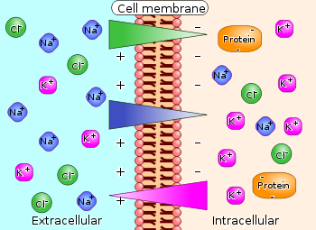

```{r echo=FALSE, warning=FALSE, message=FALSE}
library(tidyverse)
```

# Prelude

## How to play EyeWire (03:56)

<iframe width="560" height="315" src="https://www.youtube.com/embed/zMmjGExpDP8" frameborder="0" allow="accelerometer; autoplay; encrypted-media; gyroscope; picture-in-picture" allowfullscreen></iframe>

<http://eyewire.org>

## Announcements

- Exam 1 next Thursday, 2/7
    - 40 questions
- Complete 1 "component/section" in EyeWire, earn 5 extra credit points.
    - Take screen shot, email to Courtney
    - Due before Spring Break

## Today's Topics

- Warm-up (Review Quiz 1)
- Cells of the nervous system
    + *Glia*
    + *Neurons*
- How do these cells communicate?

# Warm-up (Review Quiz 1)

---

<div class="centered">

</div>

## 1. The image illustrates what type of slice? 

- Sagittal
- Dorsal 
- Coronal 
- Axial

## 1. The image illustrates what type of slice? 

- Sagittal
- Dorsal 
- Coronal 
- <span class="red">Axial</span>

## 2. The figure illustrates the use of _________ magnetic resonance imaging (MRI), a technique with a ________ spatial resolution

- functional; fair (~ 3+ mm)
- structural; good (~ 1 mm)
- neural; excellent (~ 1 micron)
- diffusion tensor; poor (~ 1 cm)

## 2. The figure illustrates the use of _________ magnetic resonance imaging (MRI), a technique with a ________ spatial resolution

- functional; fair (~ 3 mm)
- <span class="red">structural; good (~ 1 mm)</span>
- neural; excellent (~ 1 micron)
- diffusion tensor; poor (~ 1 cm)

##  3. Event-related potentials are detected using ___________; they measure ___________.

- positron emission tomography (PET); local metabolic rates
- magnetic resonance imaging (MRI); the integrity of white matter fiber tracts 
- electroencephalography (EEG); the time-locked electrical activity of large number of neurons
- magnetoencephalography (MEG); average brain magnetic activity

##  3. Event-related potentials are detected using ___________; they measure ___________.

- positron emission tomography (PET); local metabolic rates
- magnetic resonance imaging (MRI); the integrity of white matter fiber tracts
- <span class="red">electroencephalography (EEG); the time-locked electrical activity of large number of neurons</span>
- magnetoencephalography (MEG); average brain magnetic activity

## 4. All of these structures are components of the midbrain EXCEPT:

- Superior colliculus
- 3rd ventricle
- Tegmentum
- Inferior colliculus

## 4. All of these structures are components of the midbrain EXCEPT:

- Superior colliculus
- <span class="red">3rd ventricle</span>
- Tegmentum
- Inferior colliculus

## 5. Why does fMRI represent an indirect measure of brain activity?

- It measures brain structure, not function.
- It measures electrical activity, but neurons send chemical messages.
- It measures changes in blood oxygen and blood flow that follow neural activity.
- It has poor spatial resolution.

## 5. Why does fMRI represent an indirect measure of brain activity?

- It measures brain structure, not function.
- It measures electrical activity, but neurons send chemical messages.
- <span class="red">It measures changes in blood oxygen and blood flow that follow neural activity.</span>
- It has poor spatial resolution.

## 6. Which philosopher believed that the pineal gland had a special role in both reflexive and voluntary action?

- Aristotle
- Galen
- Vesalius
- Descartes

## 6. Which philosopher believed that the pineal gland had a special role in both reflexive and voluntary action?

- Aristotle
- Galen
- Vesalius
- <span class="red">Descartes</span>

## 7. Anterograde and retrograde histochemical tracers help neuroscientists determine:

- What stimuli best activate a brain region
- What connects where
- When to stimulate a brain region for maximum effect
- Whether a brain area is functioning normally

## 7. Anterograde and retrograde histochemical tracers help neuroscientists determine:

- What stimuli best activate a brain region
- <span class="red">What connects where</span>
- When to stimulate a brain region for maximum effect
- Whether a brain area is functioning normally

## 8. Which of these landmarks separates the left from the right cerebral hemisphere?

- Lateral fissure
- Longitudinal fissure
- Anterior cingulate gyrus
- Central sulcus

## 8. Which of these landmarks separates the left from the right cerebral hemisphere?

- Lateral fissure
- <span class="red">Longitudinal fissure</span>
- Anterior cingulate gyrus
- Central sulcus

## 9. Visual information enters the CNS via the 2nd (II) cranial or _______ nerve and projects to __________ of the thalamus:

- optic; lateral geniculate nucleus
- olfactory; striatum 
- optic; substantia nigra
- oculomotor; superior colliculus

## 9. Visual information enters the CNS via the 2nd (II) cranial or _______ nerve and projects to __________ of the thalamus:

- <span class="red">optic; lateral geniculate nucleus</span>
- olfactory; striatum 
- optic; substantia nigra
- oculomotor; superior colliculus

## 10. All of these structures are components of the midbrain EXCEPT: 

- Tectum
- Hippocampus
- Inferior colliculus
- Tegmentum 

## 10. All of these structures are components of the midbrain EXCEPT: 

- Tectum
- <span class="red">Hippocampus</span>
- Inferior colliculus
- Tegmentum

<!-- BAD! Two questions that ask the same thing!!! -->

## 11. This forebrain structure in the central diencephalon controls both the autonomic nervous system and the endocrine system:

- Hippocampus
- Thalamus
- Medulla
- Hypothalamus

## 11. This forebrain structure in the central diencephalon controls both the autonomic nervous system and the endocrine system:

- Hippocampus
- Thalamus
- Medulla
- <span class="red">Hypothalamus</span>

---

<div class="centered">

</div>

## 12. The arrow in the figure on page 2 shows two parts of the brain that are structurally related and adjacent to one another, the _________ and the _________.

- lateral fissure; temporal lobes
- spinal cord; lateral ventricles
- amygdala; tectum
- basal ganglia; 4th ventricle

## 12. The arrow in the figure shows two parts of the brain that are structurally related and adjacent to one another, the _________ and the _________.

- <span class="red">lateral fissure; temporal lobes</span>
- spinal cord; lateral ventricles
- amygdala; tectum
- basal ganglia; 4th ventricle

# Cells of the nervous system

## How many neurons and glia?

- Old "lore": ~100 billion neurons
- New estimate [@azevedo2009equal]
    + ~86 +/- 8 billion neurons
    + ~85 +/- 9 billion glia
- 100-500 trillion synapses, 1 billion/mm^3

## Could you count to 170 billion? {.bigger}

- How many years to count to 170 billion?
- 60 s/min x 60 min/hr x 24 hrs/day x 365 days/ yr = 31,536,000 s/yr
- 1.7e11/31,536,000 = 5,390 years

## Mass, Neurons, Non-Neurons

<div class="centered">


[[@azevedo2009equal]](http://doi.org/10.1002/cne.21974)
</div>

## Neurons by brain mass

```{r echo=FALSE, fig.align='center'}
# data from Azevedo
mass_g <- c(1232.93, 154.02, 117.66)
portion <- c("cerebral ctx", "cerebellum", "rest")
b_neurons <- c(16.34, 69.03, 0.69)
b_nonneurons <- c(60.84, 16.04, 7.73)
brain <- data.frame(portion, mass_g, b_neurons, b_nonneurons)

brain %>% ggplot() +
  aes(x=mass_g, b_neurons, color=portion) +
  geom_point(size = 5) +
  xlab("Mass in g") +
  ylab("Billions of cells")
```

## Non-neuronal cells by brain mass

```{r, echo=FALSE, fig.align='center'}
brain %>% ggplot() +
  aes(x=mass_g, b_nonneurons, color=portion) +
  geom_point(size = 5) +
  xlab("Mass in g") +
  ylab("Billions of cells")
```

## How many neurons and glia? {.bigger}

*"These findings challenge the common view that humans stand out from other primates in their brain composition and indicate that, with regard to numbers of neuronal and nonneuronal cells, the human brain is an isometrically scaled-up primate brain."*

[[@azevedo2009equal]](http://doi.org/10.1002/cne.21974)

## The Human Advantage

<div class="centered">

</div>

## Glia (neuroglia)

- "Glia" means glue
- Functions
	+ Structural support
	+ Metabolic support
	+ Brain development
	+ Neural plasticity?

## Astrocytes

- "Star-shaped"
- Physical and metabolic support
	+ Blood/brain barrier
	+ Ion (Ca++/K+) buffering
	+ Neurotransmitter (e.g., glutamate) buffering
	
## Astrocytes

- Shape brain development, [synaptic plasticity](https://en.wikipedia.org/wiki/Synaptic_plasticity)
- Regulate local blood flow
- Regulate/influence communication between neurons, [[@bazargani_astrocyte_2016]](http://doi.org/10.1038/nn.4201)
- Disruption linked to cognitive impairment, disease [[@chung_glia_2015]](http://doi.org/10.1038/nn.4142)
	
## Astrocytes

<div class="centered">
<a href="https://upload.wikimedia.org/wikipedia/commons/5/56/Human_astrocyte.png">

</a>
</div>

## Myelinating cells

- Produce [myelin](https://en.wikipedia.org/wiki/Myelin) or myelin sheath
  + White, fatty substance
  + Surrounds many neurons
  + The "white" in white matter
- Provide electrical/chemical insulation
- Make neuronal messages faster, less susceptible to noise
  
## Types of myelin-producing cells

- [Oligodendrocytes](https://en.wikipedia.org/wiki/Oligodendrocyte)
	+ In brain and spinal cord (CNS)
	+ 1:many neurons
- [Schwann cells](https://en.wikipedia.org/wiki/Schwann_cell)
	+ In PNS
	+ 1:1 neuron
	+ Facilitate neuro-regeneration
	
## Oligodendrocytes

<div class="centered">
<a href="https://upload.wikimedia.org/wikipedia/commons/thumb/8/8a/Oligodendendrocytes_in_rat_brain.tif/lossy-page1-800px-Oligodendendrocytes_in_rat_brain.tif.jpg">

</a>
</div>

## Schwann Cells

<div class="centered">
<a href="http://medcell.med.yale.edu/systems_cell_biology/nervous_system_lab/images/myelinated_axon_em_labels.jpg">

</a>
</div>

## Microglia

- [Phagocytosis](https://en.wikipedia.org/wiki/Phagocytosis)
- Clean-up damaged, dead tissue
- Prune synapses in normal development and disease
- Disruptions in microglia pruning -> impaired functional brain connectivity and social behavior, [[@zhan_deficient_2014]](http://doi.org/10.1038/nn.3641)

## Microglia

<div class="centered">
<a href="http://faculty.sites.uci.edu/kimgreen/bio/microglia-in-the-healthy-brain/">

</a>
</div>

<div class="notes">
Microglia in red invading dentate gyrus.
</div>

## [Neurons](https://en.wikipedia.org/wiki/Neuron)

<div class="centered">
<a href="http://www.extremetech.com/wp-content/uploads/2012/03/a-mouse-hippocampus-640x353.jpg">

</a>
</div>

## Fun facts about [neurons](https://en.wikipedia.org/wiki/Neuron)

- Specialized for electrical & chemical communication
- Post-mitotic -- don't divide
- Most [born early in life](http://www.ninds.nih.gov/disorders/brain_basics/ninds_neuron.htm), [[@bhardwaj_neocortical_2006]](http://doi.org/10.1073/pnas.0605177103)
- Among longest-lived cells in body, may scale with organism lifespan [[@magrassi_lifespan_2013]](http://doi.org/10.1073/pnas.1217505110)
- Can extend over long distances

## Macrostructure of [neurons](https://en.wikipedia.org/wiki/Neuron)

- [Dendrites](https://en.wikipedia.org/wiki/Dendrite)
- [Soma (cell body)](https://en.wikipedia.org/wiki/Soma_(biology))
- [Axons](https://en.wikipedia.org/wiki/Axon)
- [Terminal buttons (boutons)](https://en.wikipedia.org/wiki/Axon_terminal)

## Structure of neurons

<div class="centered">
<a href="https://upload.wikimedia.org/wikipedia/commons/thumb/a/a9/Complete_neuron_cell_diagram_en.svg/1280px-Complete_neuron_cell_diagram_en.svg.png">

</a>
</div>

## [Dendrites](https://en.wikipedia.org/wiki/Dendrite)

- Branch-like "extrusions" from cell body
- Majority of input to neuron
- Cluster close to cell body/soma
- Usually receive info
- Passive (do not regenerate electrical signal) vs. active (regenerate signal)
- Spines

## [Dendrites](https://en.wikipedia.org/wiki/Dendrite)

<div class="centered">
<a href="http://i.livescience.com/images/i/000/058/588/original/brain-cell.jpg?1383065356">

</a>
</div>

## Dendritic Spines

<div class="centered">
<a href="https://upload.wikimedia.org/wikipedia/commons/b/b1/Dendritic_spines.jpg">

</a>
</div>

## [Soma (cell body)](https://en.wikipedia.org/wiki/Soma_(biology))

- Varied shapes
- Nucleus
	+ Chromosomes
- Organelles
	+ Mitochonrdria
	+ Smooth and Rough Endoplasmic reticulum (ER)
	
## [Soma](https://en.wikipedia.org/wiki/Soma_(biology))

<div class="centered">
<a href="https://upload.wikimedia.org/wikipedia/commons/thumb/a/a9/Complete_neuron_cell_diagram_en.svg/1280px-Complete_neuron_cell_diagram_en.svg.png">

</a>
</div>

## [Axons](https://en.wikipedia.org/wiki/Axon)

- Another branch-like "extrusion" from soma
- Extend farther than dendrites
- Usually transmit info

## [Axons](https://en.wikipedia.org/wiki/Axon)

- Parts
    + **Initial segment** (closest to soma, unmyelinated)
    + **Nodes of Ranvier** (unmyelinated segments along axon)
    + Terminals, axon terminals, terminal buttons, synaptic terminals, synaptic boutons

## Axons

<div class="centered">
<a href="http://droualb.faculty.mjc.edu/Course%20Materials/Physiology%20101/Chapter%20Notes/Fall%202007/figure_07_02_labeled.jpg">

</a>
</div>

## [Synaptic bouton (terminal button)](https://en.wikipedia.org/wiki/Axon_terminal)

- [Synapse](https://en.wikipedia.org/wiki/Chemical_synapse#Structure) (~5-10K per neuron) 
- Presynaptic membrane (sending cell) and postsynaptic (receiving cell) membrane
- Synaptic cleft -- space between cells
- [Synaptic vesicles](https://en.wikipedia.org/wiki/Synaptic_vesicle)
    + Pouches of neurotransmitters
- [Autoreceptors](https://en.wikipedia.org/wiki/Autoreceptor) (detect NTs); [transporters](https://en.wikipedia.org/wiki/Neurotransmitter_transporter) (transport NTs across membrane)

## [Synaptic bouton (terminal button)](https://en.wikipedia.org/wiki/Axon_terminal)

<div class="centered">
<a href="http://antranik.org/wp-content/uploads/2012/04/synapse.jpg">

</a>
</div>

## Classifying neurons

- Functional role
    + Input (sensory), output (motor/secretory), interneurons 
- Anatomy
    + Unipolar
    + Bipolar
    + Multipolar

---

<div class="centered">


<https://upload.wikimedia.org/wikipedia/commons/thumb/9/92/Neurons_uni_bi_multi_pseudouni.svg/2000px-Neurons_uni_bi_multi_pseudouni.svg.pngg>
</div>

## Classifying neurons

- By specific anatomy
    + Pyramidal cells
    + Stellate cells 
    + Purkinje cells 
    + Granule cells
    
<!-- http://biodrawing.com/Neurology_modules/NervousSystemSite/Neuroanatomy/figures/Cytology-Neurons_types_small.png -->

## Neurons by type

<div class="centered">
<!--  -->

<!-- <http://blogs.scientificamerican.com/brainwaves/files/2012/05/selection-glamor-FINAL-300x225.jpg> -->


</div>

# How neurons communicate

## Neural communication

- Electrical
    + Fast(er)
    + Metabolically costly
    + Within neurons
- Chemical
    + Slow(er)
    + Metabolically cheap
    + Between neurons, & brain <-> body (via hormones)

## How are messages generated?

- Electrical potential (== voltage)
    + Think of potential energy
    + Voltage ~ pressure
    + Energy that will be released if something changes

## Potential energy

<div class="centered">
<a href="http://physics20project.weebly.com/uploads/1/6/4/8/16484122/1358825569.png">

</a>
</div>

## Types of neural electrical potentials

- [Resting potential](https://en.wikipedia.org/wiki/Resting_potential)
- [Action potential](https://en.wikipedia.org/wiki/Action_potential)

## [Resting potential](https://en.wikipedia.org/wiki/Resting_potential)

- How to measure
    + Electrode on inside
    + Electrode on outside
    + Inside - Outside = potential

## [Resting potential](https://en.wikipedia.org/wiki/Resting_potential)

<div class="centered">
<a href="http://www.physiologyweb.com/lecture_notes/resting_membrane_potential/figs/measuring_the_membrane_potential_w.jpg">

</a>
</div>

## [Resting potential](https://en.wikipedia.org/wiki/Resting_potential)

- Neuron (and other cells) have *potential energy*
    + Inside neuron is -60-70 mV, with respect to outside
    + About 1/20th typical AAA battery
- Like charges repel, opposites attract, so
    + Positively charged particles pulled in
    + Negatively charged particles pushed out

## Where does the resting potential come from?

- Ions
- Ion channels
- Separation between charges
- A balance of forces

## We are the champIONs, my friend

- Potassium, K+
- Sodium, Na+
- Chloride, Cl-
- Organic anions, A-

## Resting potential arises from

- A balance of forces
    + Force of diffusion
    + Electrostatic force
- Forces cause ion flows across membrane
- Ion channels allow ion flow

## Ion channels

- Openings in neural membrane
- Selective
- Vary in permeability

## Ion channel Types

+ *Passive/leak*
    - Always open
+ *Voltage-gated*
    - Open/close at certain voltages
+ *Ligand-gated* (chemically-gated)
    - Open/close in presence of special chemicals (ligands)
+ Transporters/pumps
    - Move (transport/pump) ions using metabolic energy
    
## Ion channels

<div class="centered">
<a href="http://www.zoology.ubc.ca/~gardner/F21-08.GIF">

</a>
</div>

## Neuron at rest permeable to K+

- Passive K+ channels open
- [K+] concentration inside >> outside
- K+ flows out

## Force of diffusion

<div class="centered">
<a href="https://upload.wikimedia.org/wikipedia/commons/thumb/7/72/Diffusion.en.svg/1000px-Diffusion.en.svg.png">

</a>
</div>

## Force of diffusion

<div class="centered">
<a href="https://upload.wikimedia.org/wikipedia/commons/1/12/Bubble_bath.jpg">

</a>
</div>

## Neuron at rest permeable to K+

- Organic anions (A-) too large to move outside of cell
- A- and K+ largely in balance == no net internal charge
- K+ outflow creates charge separation: K+ <-> A-
- Charge separation creates a voltage
- Outside +/inside -
- Voltage build-up stops outflow of K+ (before inside/outside concentrations are ==)

## The resting potential

<div class="centered">

</div>

## Balance of forces in the neuron at rest

- **Force of diffusion**
    + K+ moves from high concentration (inside) to low (outside)
    
## Balance of forces in the neuron at rest

- **Electrostatic force**
    + Positive K+ accumulate along outside
    - Negative A- accumulate along inside
    - K+ || A- along membrane creates battery-like voltage
    + Voltage build-up stops K+ outflow
    
## Electrostatic force

+ Specific voltage called *equilibrium potential* for K+
+ K+ positive, so equilibrium potential negative (w/ respect to outside)
+ Equilibrium potential close to neuron resting potential
    
## [Equilibrium potentials calculated](http://www.physiologyweb.com/calculators/nernst_potential_calculator.html) under typical conditions

| Ion | [inside]  | [outside]    | Voltage    |
|-----|-----------|--------------|------------|
| K+  | ~150 mM   | ~4 mM        | ~ -90 mV    |
<!-- | Na+ | ~10 mM    | ~140 mM      | ~ +55-60 mV | -->
<!-- | Cl- | ~10 mM    | ~110 mM      | - 65-80 mV  | -->

<div class="centered">
<a href="http://www.physiologyweb.com/lecture_notes/resting_membrane_potential/figs/nernst_equation_v_k.gif">

</a>
</div>

## Electrical circuit model

<div class="centered">
<a href="https://upload.wikimedia.org/wikipedia/commons/thumb/3/33/MembraneCircuit.jpg/500px-MembraneCircuit.jpg">

</a>
</div>

## Resting potential ≠ K+ [equilibrium potential](https://courses.washington.edu/conj/membpot/equilpot.htm)

- Resting potential not just due to K+ flow
- Other ions flow
- Resting potential == net effects of all ion flows across membrane

## Next time

- More on neural communication
- What are the other ions doing?

## References {.smaller}
