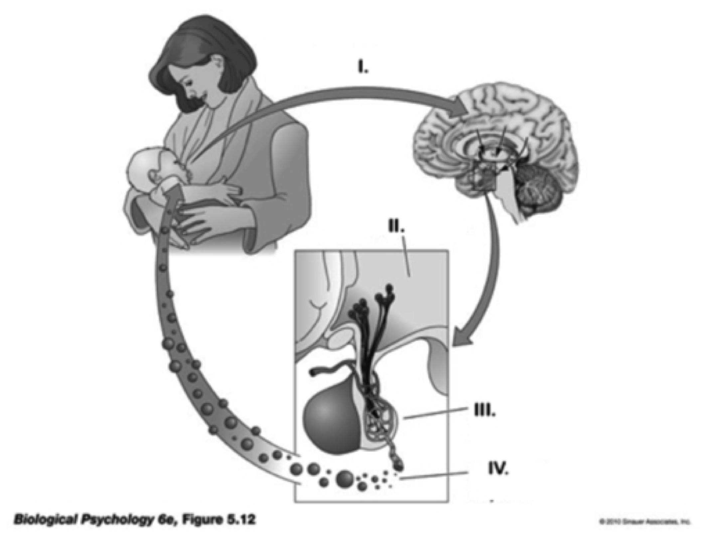

## Today's topics

- Quiz 3
- Review of Exam 2

# Exam 2--Part 1

## 1. True or False. The primate cerebellum is larger in volume than the cerebral cortex but contains fewer nerve cells. 

- True
- False

## 1. True or False. The primate cerebellum is larger in volume than the cerebral cortex but contains fewer nerve cells. 

- True
- **False**

## 2. Influx of ______ ions into the presynaptic terminal triggers the release of neurotransmitters by means of ______ 

- Na+; ion transportation.
- Cl-; inhibitory postsynaptic potential enhancement. 
- Ca++; exocytosis.
- K+; Na+/K+ pump activity. 

## 2. Influx of ______ ions into the presynaptic terminal triggers the release of neurotransmitters by means of ______ 

- Na+; ion transportation.
- Cl-; inhibitory postsynaptic potential enhancement. 
- **Ca++; exocytosis**.
- K+; Na+/K+ pump activity. 

## 3. All of the following are components of the SAM axis, except: 

- Midbrain. 
- Sympathetic nervous system. 
- Adrenal medulla.
- Hypothalamus. 

## 3. All of the following are components of the SAM axis, except: 

- **Midbrain**. 
- Sympathetic nervous system. 
- Adrenal medulla.
- Hypothalamus. 

## Match the hormone to its function: 

## 4. Oxytocin

- stress response; increases blood in glucose; anti-inflammatory effect. 
- uterine contraction; milk release; bonding. 
- regulates seasonal changes; sexual maturation. 
- blood vessel constriction; antidiuretic hormone.
 
## 4. Oxytocin

- stress response; increases blood in glucose; anti-inflammatory effect. 
- **uterine contraction; milk release; bonding**. 
- regulates seasonal changes; sexual maturation. 
- blood vessel constriction; antidiuretic hormone.
 
## 5. Cortisol 

- stress response; increases in blood glucose; anti-inflammatory effect. 
- uterine contraction; milk release; bonding.
- regulates seasonal changes; sexual maturation. 
- blood vessel constriction; antidiuretic hormone. 

## 5. Cortisol 

- **stress response; increases in blood glucose; anti-inflammatory effect**. 
- uterine contraction; milk release; bonding.
- regulates seasonal changes; sexual maturation. 
- blood vessel constriction; antidiuretic hormone. 

## 6. Melatonin

- stress response; increases in blood glucose; anti-inflammatory effect.
- uterine contraction; milk release; bonding.
- regulates seasonal changes, circadian rhythm; sexual maturation. 
- blood vessel constriction; antidiuretic hormone. 

## 6. Melatonin

- stress response; increases in blood glucose; anti-inflammatory effect.
- uterine contraction; milk release; bonding.
- **regulates seasonal changes, circadian rhythm; sexual maturation**. 
- blood vessel constriction; antidiuretic hormone. 

## 7. Botulinum toxin (botox) blocks the release of acetylcholine (ACh) from presynaptic terminals. In large quantities, this can be ______ because it ______ 

- good; speeds the conduction of action potentials 
- bad; blocks communication to muscle fibers
- good; accelerates K+ flow
- bad; affects the size and number of presynaptic IPSPs 

## 7. Botulinum toxin (botox) blocks the release of acetylcholine (ACh) from presynaptic terminals. In large quantities, this can be ______ because it ______ 

- good; speeds the conduction of action potentials 
- **bad; blocks communication to muscle fibers**
- good; accelerates K+ flow
- bad; affects the size and number of presynaptic IPSPs 

## 8. ______ is a kind of ______ brain imaging method used to study axon fiber (white matter) tracts. 

- Structural MRI; structural
- Positron Emission Tomography (PET); functional 
- Magnetoencephalography; functional 
- diffusion tensor imaging (DTI); structural

## 8. ______ is a kind of ______ brain imaging method used to study axon fiber (white matter) tracts. 

- Structural MRI; structural
- Positron Emission Tomography (PET); functional 
- Magnetoencephalography; functional 
- **diffusion tensor imaging (DTI); structural**

## 9. The enzyme AChE contributes to the ______ of ______ 

- Breakdown and inactivation; acetylcholine
- Breakdown and inactivation; dopamine, norepinephrine, and epinephrine
- Postsynaptic reuptake; serotonin
- Increase in monoamine levels; GABA-releasing neuron 

## 9. The enzyme AChE contributes to the ______ of ______ 

- **Breakdown and inactivation; acetylcholine**
- Breakdown and inactivation; dopamine, norepinephrine, and epinephrine
- Postsynaptic reuptake; serotonin
- Increase in monoamine levels; GABA-releasing neuron 

## 10. This neurotransmitter is released by motor neurons onto skeletal muscle. 

- GABA 
- Serotonin 
- Acetylcholine 
- Glutamate 

## 10. This neurotransmitter is released by motor neurons onto skeletal muscle. 

- GABA 
- Serotonin 
- **Acetylcholine** 
- Glutamate 

## 11. Selective reuptake inhibitors like Prozac act on ______, ______ the normal process of inactivation. 

- synaptic vesicles; slowing.
- postsynaptic receptors; accelerating. 
- presynaptic transporters; slowing. 
- Na+/K+ pumps; accelerating. 

## 11. Selective reuptake inhibitors like Prozac act on ______, ______ the normal process of inactivation. 

- synaptic vesicles; slowing.
- postsynaptic receptors; accelerating. 
- **presynaptic transporters; slowing**. 
- Na+/K+ pumps; accelerating. 

## Please put in their proper order the steps that lead to synaptic communication between neurons. Begin with the presynaptic cell. 

## 12. Step 1 

- Voltage-gated Ca++ channels open. 
- Action potential propagates down the axon to the axon terminal. 
- Ca++ entry initiates exocytosis of neurotransmitter. 
- Ligand-gated receptors bind neurotransmitter and activate channels in the postsynaptic cell. 
- Neurotransmitter diffuses across the synaptic cleft. 

## 12. Step 1 

- Voltage-gated Ca++ channels open. 
- **Action potential propagates down the axon to the axon terminal**. 
- Ca++ entry initiates exocytosis of neurotransmitter. 
- Ligand-gated receptors bind neurotransmitter and activate channels in the postsynaptic cell. 
- Neurotransmitter diffuses across the synaptic cleft. 

## 13. Step 2 

- Voltage-gated Ca++ channels open. 
- Action potential propagates down the axon to the axon terminal. 
- Ca++ initiates exocytosis of neurotransmitter. 
- Ligand-gated receptors bind neurotransmitter and activate channels in the postsynaptic cell. 
- Neurotransmitter diffuses across synaptic cleft. 

## 13. Step 2 

- **Voltage-gated Ca++ channels open**. 
- Action potential propagates down the axon to the axon terminal. 
- Ca++ initiates exocytosis of neurotransmitter. 
- Ligand-gated receptors bind neurotransmitter and activate channels in the postsynaptic cell. 
- Neurotransmitter diffuses across synaptic cleft. 

## 14. Step 3 

- Voltage-gated Ca++ channels open. 
- Action potential propagates down the axon to the axon terminal. 
- Ca++ initiates exocytosis of neurotransmitter. 
- Ligand-gated receptors bind neurotransmitter and activate channels in the postsynaptic cell. 
- Neurotransmitter diffuses across synaptic cleft. 

## 14. Step 3 

- Voltage-gated Ca++ channels open. 
- Action potential propagates down the axon to the axon terminal. 
- **Ca++ initiates exocytosis of neurotransmitter**. 
- Ligand-gated receptors bind neurotransmitter and activate channels in the postsynaptic cell. 
- Neurotransmitter diffuses across synaptic cleft. 

## 15. Step 4 

- Voltage-gated Ca++ channels open. 
- Action potential propagates down the axon to the axon terminal. 
- Ca++ initiates exocytosis of neurotransmitter. 
- Ligand-gated receptors bind neurotransmitter and activate channels in the postsynaptic cell. 
- Neurotransmitter diffuses across synaptic cleft.

## 15. Step 4 

- Voltage-gated Ca++ channels open. 
- Action potential propagates down the axon to the axon terminal. 
- Ca++ initiates exocytosis of neurotransmitter. 
- Ligand-gated receptors bind neurotransmitter and activate channels in the postsynaptic cell. 
- **Neurotransmitter diffuses across synaptic cleft**.

## 16. Step 5 

- Voltage-gated Ca++ channels open. 
- Action potential propagates down the axon to the axon terminal. 
- Ca++ initiates exocytosis of neurotransmitter. 
- Ligand-gated receptors bind neurotransmitter and activate channels in the postsynaptic cell. 
- Neurotransmitter diffuses across synaptic cleft. 

## 16. Step 5 

- Voltage-gated Ca++ channels open. 
- Action potential propagates down the axon to the axon terminal. 
- Ca++ initiates exocytosis of neurotransmitter. 
- **Ligand-gated receptors bind neurotransmitter and activate channels in the postsynaptic cell**. 
- Neurotransmitter diffuses across synaptic cleft. 

## Answer the following questions. 

##  17. The meso-limbo-cortical projection from the ______ the midbrain releases the neurotransmitter ______. It is part of the brain’s ‘reward’ circuit. 

- ventral tegmental area; dopamine 
- raphe nucleus; NE
- superior colliculus; glutamate
- thalamus; GABA

##  17. The meso-limbo-cortical projection from the ______ the midbrain releases the neurotransmitter ______. It is part of the brain’s ‘reward’ circuit. 

- **ventral tegmental area; dopamine** 
- raphe nucleus; NE
- superior colliculus; glutamate
- thalamus; GABA

## 18. The lateral fissure divides the ______. 

- left hemisphere from the right
- temporal lobe from the frontal and parietal lobes
- frontal lobe from the parietal lobe
- corpus callosum from the anterior commissure

## 18. The lateral fissure divides the ______. 

- **left hemisphere from the right**
- temporal lobe from the frontal and parietal lobes
- frontal lobe from the parietal lobe
- corpus callosum from the anterior commissure

## 19. This small glial cell type contributes to the ‘pruning’ of dendritic spines from unused synapses in the CNS. 

- Pyramidal cells. 
- microglia 
- Schwann cells. 
- Stellate cells. 

## 19. This small glial cell type contributes to the ‘pruning’ of dendritic spines from unused synapses in the CNS. 

- Pyramidal cells. 
- **microglia** 
- Schwann cells. 
- Stellate cells. 

## 20. ______ receptors contain their own ion channel; ______ do not.

- Ionotropic; metabotropic
- Metabotropic; ionotropic
- GABA; glutamate
- Dopamine; serotonin

## 20. ______ receptors contain their own ion channel; ______ do not.

- **Ionotropic; metabotropic**
- Metabotropic; ionotropic
- GABA; glutamate
- Dopamine; serotonin

## 21. ______ is the primary excitatory neurotransmitter in the CNS; ______ is the primary neurotransmitter of CNS output. 

- GABA; glutamate. 
- Glutamate; GAB- 
- Glutamate; acetylcholine. 
- Acetylcholine; glutamate. 

## 21. ______ is the primary excitatory neurotransmitter in the CNS; ______ is the primary neurotransmitter of CNS output. 

- GABA; glutamate. 
- **Glutamate; GABA** 
- Glutamate; acetylcholine. 
- Acetylcholine; glutamate. 

## 22. Hormonal action ______ than neuronal action. 

- is faster-acting
- is more specific in its effects
- is slower-acting
- involves greater voluntary control

## 22. Hormonal action ______ than neuronal action. 

- is faster-acting
- is more specific in its effects
- **is slower-acting**
- involves greater voluntary control

## 23. Opening a channel permeable to Na+ in a neuron at its resting potential would have a/an ______ effect.

- excitatory 
- inhibitory
- modulatory
- Ca++ activating

## 23. Opening a channel permeable to Na+ in a neuron at its resting potential would have a/an ______ effect.

- **excitatory** 
- inhibitory
- modulatory
- Ca++ activating

## Match the endocrine structure with the function. 

## 24. Hypothalamus

- Circadian rhythms via melatonin release
- Responds to adrenocorticotropic hormone (ACTH) by releasing cortisol 
- Releases NE and epinephrine
- Controls hormone secretions into and by the pituitary

## 24. Hypothalamus

- Circadian rhythms via melatonin release
- Responds to adrenocorticotropic hormone (ACTH) by releasing cortisol 
- Releases NE and epinephrine
- **Controls hormone secretions into and by the pituitary**

## 25. Pineal gland 

- Circadian rhythms via melatonin release
- Responds to adrenocorticotropic hormone (ACTH) by releasing cortisol
- Releases NE and epinephrine
- Controls hormone secretions into and by the pituitary 

## 25. Pineal gland 

- **Circadian rhythms via melatonin release**
- Responds to adrenocorticotropic hormone (ACTH) by releasing cortisol
- Releases NE and epinephrine
- Controls hormone secretions into and by the pituitary 

## 26. Adrenal cortex

- Circadian rhythms via melatonin release
- Responds to adrenocorticotropic hormone (ACTH) by releasing cortisol 
- Releases NE and epinephrine
- Controls hormone secretions into and by the pituitary

## 26. Adrenal cortex

- Circadian rhythms via melatonin release
- **Responds to adrenocorticotropic hormone (ACTH) by releasing cortisol**
- Releases NE and epinephrine
- Controls hormone secretions into and by the pituitary

## Answer the following questions. 

## 27. Animals with complex nervous systems emerged ______. 

- about 4.5 billion years ago. 
- about 13.7 billion years ago. 
- 500-600 million years ago. 
- Within the last 10,000 years. 

## 27. Animals with complex nervous systems emerged ______. 

- about 4.5 billion years ago. 
- about 13.7 billion years ago. 
- **500-600 million years ago**. 
- Within the last 10,000 years. 

## 28. Gap junctions support ______ between cells.
 
- direct electrical coupling 
- chemical communication 
- slow communication
- hormonal signaling 

## 28. Gap junctions support ______ between cells.
 
- **direct electrical coupling** 
- chemical communication 
- slow communication
- hormonal signaling 

## 29. The release of glutamate onto an (ionotropic) AMPA receptor on a neuron’s dendrite produces an ______. 

- inhibitory postsynaptic potential (IPSP)
- electrochemical postsynaptic potential (EPSP)
- inwardly-driven postsynaptic potential (IPSP) 
- excitatory postsynaptic potential (EPSP) 

## 29. The release of glutamate onto an (ionotropic) AMPA receptor on a neuron’s dendrite produces an ______. 

- inhibitory postsynaptic potential (IPSP)
- electrochemical postsynaptic potential (EPSP)
- inwardly-driven postsynaptic potential (IPSP) 
- **excitatory postsynaptic potential (EPSP)**

## 30. Both Parkinson’s Disease and schizophrenia have been linked to disturbances in ______ neurotransmitter systems. 

- dopamine
- GABA 
- acetylcholine 
- serotonin

## 30. Both Parkinson’s Disease and schizophrenia have been linked to disturbances in ______ neurotransmitter systems. 

- **dopamine**
- GABA 
- acetylcholine 
- serotonin

## 31. True or False. There are many details about how evolution occurred that are not yet well established. 
- True. 
- False. 

## 31. True or False. There are many details about how evolution occurred that are not yet well established. 
- **True**. 
- False. 

## 32. The human ______ has about 16 billion neurons, ______ than any other animal, including animals with larger brains.
 
- cerebellum; fewer 
- cerebral cortex; fewer 
- cerebral cortex; more 
- cerebellum; more

## 32. The human ______ has about 16 billion neurons, ______ than any other animal, including animals with larger brains.
 
- cerebellum; fewer 
- cerebral cortex; fewer 
- **cerebral cortex; more** 
- cerebellum; more

## 33. All of the following are characteristics of the vertebrate central nervous system EXCEPT. 

- radial symmetry.
- segmentation. 
- encephalization. 
- identifiable forebrain, midbrain, and hindbrain components. 

## 33. All of the following are characteristics of the vertebrate central nervous system EXCEPT. 

- **radial symmetry**.
- segmentation. 
- encephalization. 
- identifiable forebrain, midbrain, and hindbrain components. 

## 34. Brain mass ______ body mass in vertebrates. 

- increases with
- decreases with
- has no relationship to
- can't be measured like 

## 34. Brain mass ______ body mass in vertebrates. 

- **increases with**
- decreases with
- has no relationship to
- can't be measured like 

## Match the Roman numeral in the figures below, to the process and structures in the hormonal action cycle the figure depicts.

---

## 35. I 

- Posterior pituitary receives impulses from hypothalamus. 
- Sensory nerve impulses project to the brain. 
- Release of oxytocin into blood stream. 
- Hypothalamus responds to sensory input. 

## 35. I 

- Posterior pituitary receives impulses from hypothalamus. 
- **Sensory nerve impulses project to the brain**. 
- Release of oxytocin into blood stream. 
- Hypothalamus responds to sensory input. 

---

## 36. II 

- Posterior pituitary receives impulses from hypothalamus.
- Sensory nerve impulses project to the brain.
- Release of oxytocin into blood stream. 
- Hypothalamus responds to sensory input. 

## 36. II 

- Posterior pituitary receives impulses from hypothalamus.
- Sensory nerve impulses project to the brain.
- Release of oxytocin into blood stream. 
- **Hypothalamus responds to sensory input**. 

---

## 37. III 

- Posterior pituitary receives impulses from hypothalamus. 
- Sensory nerve impulses project to the brain.
- Release of oxytocin into blood stream. 
- Hypothalamus responds to sensory input. 

## 37. III 

- **Posterior pituitary receives impulses from hypothalamus**. 
- Sensory nerve impulses project to the brain.
- Release of oxytocin into blood stream. 
- Hypothalamus responds to sensory input. 

---

## 38. IV

- Posterior pituitary receives impulses from hypothalamus.
- Sensory nerve impulses project to the brain. 
- Release of oxytocin into blood stream. 
- Hypothalamus responds to sensory input.

## 38. IV

- Posterior pituitary receives impulses from hypothalamus.
- Sensory nerve impulses project to the brain. 
- **Release of oxytocin into blood stream**. 
- Hypothalamus responds to sensory input.

## Answer the following questions.

## 39. Which of the following statements are inconsistent with the theory of evolution.

- Organisms existed in the distant past that no longer exist today.
- Organisms differ in the extent to which they survive and reproduce successfully.
- The history of life on Earth is too short for new species to have evolved.
- Offspring inherit many traits from their parents. 

## 39. Which of the following statements are inconsistent with the theory of evolution.

- Organisms existed in the distant past that no longer exist today.
- Organisms differ in the extent to which they survive and reproduce successfully.
- **The history of life on Earth is too short for new species to have evolved**.
- Offspring inherit many traits from their parents. 

## 40. All of these animals except ______, have relatively large brains for their body sizes and correspondingly high cognitive capacities.

- chimpanzees. 
- mice. 
- humans. 
- corvids (crows and ravens). 

## 40. All of these animals except ______, have relatively large brains for their body sizes and correspondingly high cognitive capacities.

- chimpanzees. 
- **mice**. 
- humans. 
- corvids (crows and ravens). 

# Part 2--Exam 2 Bonus 

## 41. The hippocampus is located deep within which lobe of the cerebral cortex? 

- Temporal. 
- Frontal. 
- Parietal. 
- Occipital. 

## 41. The hippocampus is located deep within which lobe of the cerebral cortex? 

- **Temporal**. 
- Frontal. 
- Parietal. 
- Occipital. 

## 42. Histamine is one of the ______ group of neurotransmitters. It is released by the ______. 

- monoamine; hippocampus 
- monoamine; hypothalamus 
- amino acid; midbrain 
- peptide; amygdala 

## 42. Histamine is one of the ______ group of neurotransmitters. It is released by the ______. 

- monoamine; hippocampus 
- **monoamine; hypothalamus** 
- amino acid; midbrain 
- peptide; amygdala 

## 43. The 10th cranial (Xth) or vagus nerve connects to the ______ branch of the autonomic nervous system. Its neurons tend to slow heart rate and activate digestion when stimulated. 

- parasympathetic 
- sympathetic
- enteric
- somatic 

## 43. The 10th cranial (Xth) or vagus nerve connects to the ______ branch of the autonomic nervous system. Its neurons tend to slow heart rate and activate digestion when stimulated. 

- **parasympathetic** 
- sympathetic
- enteric
- somatic 

## 44. Corticotropin Releasing Hormone (CRH) is released by the ______ into the ______. 

- hippocampus; amygdala 
- adrenal cortex; blood stream
- hypothalamus; anterior pituitary
- medulla oblongata; adrenal medulla

## 44. Corticotropin Releasing Hormone (CRH) is released by the ______ into the ______. 

- hippocampus; amygdala 
- adrenal cortex; blood stream
- **hypothalamus; anterior pituitary**
- medulla oblongata; adrenal medulla

## Part 3--Questions from Exam #1

## 45. These tissues provide external structural support and protection for the CNS. 

- Astrocytes 
- Meninges 
- Cerebral ventricles 
- Circle of Willis

## 45. These tissues provide external structural support and protection for the CNS. 

- Astrocytes 
- **Meninges** 
- Cerebral ventricles 
- Circle of Willis

## 46. The thalamus serves this function, among others.

- Metabolic, physical support of neurons
- Sensory relay
- Preparation for action
- Memory storage and retrieval
- CNS protection

## 46. The thalamus serves this function, among others.

- Metabolic, physical support of neurons
- **Sensory relay**
- Preparation for action
- Memory storage and retrieval
- CNS protection

## 47. ______, a type of glial cell, help regulate local blood oxygen levels in response to neuronal activity. These cells thus contribute to the signal measured by ______. 
- Oligodendrocytes; MEG 
- Schwann cells; structural MRI 
- Astrocytes; functional MRI 
- Microglia; structural and functional MRI

## 47. ______, a type of glial cell, help regulate local blood oxygen levels in response to neuronal activity. These cells thus contribute to the signal measured by ______. 
- Oligodendrocytes; MEG 
- Schwann cells; structural MRI 
- **Astrocytes; functional MRI** 
- Microglia; structural and functional MRI

## 48. Which of the following statements about neurons is INCORRECT? 

- Neurons have very long lives. 
- Neurons can extend over long distances. 
- Neurons are the only cells that have negative resting potentials. 
- Neurons use both electrical and chemical mechanisms to communicate.

## 48. Which of the following statements about neurons is INCORRECT? 

- Neurons have very long lives. 
- Neurons can extend over long distances. 
- **Neurons are the only cells that have negative resting potentials**. 
- Neurons use both electrical and chemical mechanisms to communicate.

## 49. Primary motor cortex is found in the ______. 

- Temporal lobe 
- Frontal lobe 
- Hypothalamus 
- Basal ganglia 
- Parietal lobe

## 49. Primary motor cortex is found in the ______. 

- Temporal lobe 
- **Frontal lobe** 
- Hypothalamus 
- Basal ganglia 
- Parietal lobe

## 50. Nodes of Ranvier, or gaps in the myelination of an axon, serve which purpose? 

- Increase the speed of propagation. 
- Allow space in the axon for neurotransmitter release. 
- Provide structural support to the neuron. 
- Combine input from different dendrites

## 50. Nodes of Ranvier, or gaps in the myelination of an axon, serve which purpose? 

- **Increase the speed of propagation**. 
- Allow space in the axon for neurotransmitter release. 
- Provide structural support to the neuron. 
- Combine input from different dendrites

## 51. The ______ plays a role in biologically crucial behaviors, including those associated with ingestion (eating and drinking) and reproduction: 

- Temporal lobe 
- Frontal lobe 
- Hypothalamus 
- Basal ganglia 
- Parietal lobe

## 51. The ______ plays a role in biologically crucial behaviors, including those associated with ingestion (eating and drinking) and reproduction: 

- Temporal lobe 
- Frontal lobe 
- **Hypothalamus** 
- Basal ganglia 
- Parietal lobe

## 52. During the absolute refractory period, a neuron will ______. 

- fire again in response to an especially strong input
- produce an action potential that is twice the normal size
- open voltage-gated Ca++ channels
- not fire no matter the strength of the input

## 52. During the absolute refractory period, a neuron will ______. 

- fire again in response to an especially strong input
- produce an action potential that is twice the normal size
- open voltage-gated Ca++ channels
- **not fire no matter the strength of the input**

## 53. The tough, canvas-like tissue that surrounds and protects the ______ is called ______:

- white matter; cerebrospinal fluid (CSF) 
- gray matter; myelin 
- central nervous system (CNS); dura mater 
- cerebral ventricles; endothelial cells

## 53. The tough, canvas-like tissue that surrounds and protects the ______ is called ______:

- white matter; cerebrospinal fluid (CSF) 
- gray matter; myelin 
- **central nervous system (CNS); dura mater** 
- cerebral ventricles; endothelial cells

## 54. How many neurons are there in the human brain? 

- About 86 billion. 
- About 86 million. 
- About the same number of seconds as in the average lifetime. 
- It can’t be estimated.

## 54. How many neurons are there in the human brain? 

- **About 86 billion**. 
- About 86 million. 
- About the same number of seconds as in the average lifetime. 
- It can’t be estimated.

# Part 4--Bonus from Exam #1

## 55. In a typical neuron near or slightly above its resting potential chloride (Cl-) ions would flow ______ following the concentration gradient. This would move the neuron ______ its firing threshold. 

- Inward; farther from 
- Inward; closer to 
- Outward; farther from 
- Outward; closer to

## 55. In a typical neuron near or slightly above its resting potential chloride (Cl-) ions would flow ______ following the concentration gradient. This would move the neuron ______ its firing threshold. 

- **Inward; farther from** 
- Inward; closer to 
- Outward; farther from 
- Outward; closer to

## 56. A toxin found in Japanese pufferfish blocks voltage-gated Na+ channels. Applying such a toxin to neurons would have what effect? 

- Slower falling phase of the action potential. 
- Increasing the concentration of Na+ inside the cell. 
- K+ ions would accelerate their flow to compensate. 
- Action potentials would be abolished.

## 56. A toxin found in Japanese pufferfish blocks voltage-gated Na+ channels. Applying such a toxin to neurons would have what effect? 

- Slower falling phase of the action potential. 
- Increasing the concentration of Na+ inside the cell. 
- K+ ions would accelerate their flow to compensate. 
- **Action potentials would be abolished**.
