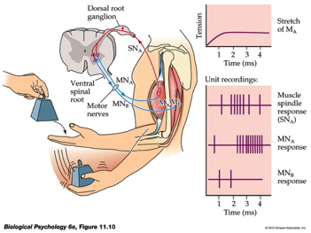
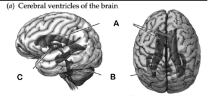
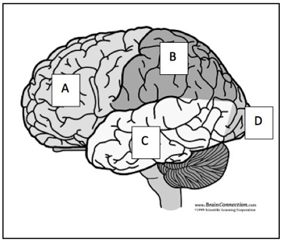

# Exam 3--Part 1

---

## 1. The figure depicts the \____________, one of the simplest circuits in the nervous system. It regulates \___________
               .
- biceptual reflex; balance
- myotatic/stretch reflex; muscle length/position
- optokinetic reflex; muscle strength
- Cartesian reflex; skeletal-muscular activity

## 1. The figure depicts the \____________, one of the simplest circuits in the nervous system. It regulates \___________
               .
- biceptual reflex; balance
- myotatic/stretch reflex; muscle length/position
- optokinetic reflex; muscle strength
- Cartesian reflex; skeletal-muscular activity

## 2. This circuit has a/an \___________ branch in which stretch receptors in intrafusal muscle fibers \___________ the extrafusal muscle fibers from the antagonist muscle.

- polysynaptic; inhibit
- autonomic; inhibit
- monosynaptic; excite
- monosynaptic; inhibit 

## 2. This circuit has a/an \___________ branch in which stretch receptors in intrafusal muscle fibers \___________ the extrafusal muscle fibers from the antagonist muscle.

- polysynaptic; inhibit
- autonomic; inhibit
- monosynaptic; excite
- monosynaptic; inhibit 

## 3. Plutchik’s biological approach to emotion focuses on an emotion’s \___________ and \___________.                 .
- subjective feelings; facial expressions
- action tendencies (tendency to approach or avoid); valence (positive/negative)
- intensity; subjective feelings
- influence on reproduction; link to defense behavior

## 3. Plutchik’s biological approach to emotion focuses on an emotion’s \___________ and \___________.                 .
- subjective feelings; facial expressions
- action tendencies (tendency to approach or avoid); valence (positive/negative)
- intensity; subjective feelings
- influence on reproduction; link to defense behavior

## 4. The serotonin hypothesis of depression suggests that \___________.

- lowered 5-HT levels are part of the disorder
- increased 5-HT levels are part of the disorder
- lower ACh levels exacerbate the disorder’s positive symptoms 
- higher DA levels are linked to the disorder’s positive symptoms

## 4. The serotonin hypothesis of depression suggests that \___________.

- lowered 5-HT levels are part of the disorder
- increased 5-HT levels are part of the disorder
- lower ACh levels exacerbate the disorder’s positive symptoms 
- higher DA levels are linked to the disorder’s positive symptoms

## 5. The primary purpose of the extrafusal muscle fibers is to \___________.

- Generate force
- Inhibit the contraction of muscles
- Sense tension/length
- All of the above

## 5. The primary purpose of the extrafusal muscle fibers is to \___________.

- Generate force
- Inhibit the contraction of muscles
- Sense tension/length
- All of the above

## 6. Which of the following is true regarding fibers that link somatosensory receptors to the central nervous system?

- Fibers that are smallest in diameter conduct information the fastest. 
- Thin fibers are generally the most heavily myelinated.
- Temperature-related information is conducted faster than touch-related information.
- Muscle spindle receptor axons are thickest and most heavily myelinated.

## 6. Which of the following is true regarding fibers that link somatosensory receptors to the central nervous system?

- Fibers that are smallest in diameter conduct information the fastest. 
- Thin fibers are generally the most heavily myelinated.
- Temperature-related information is conducted faster than touch-related information.
- Muscle spindle receptor axons are thickest and most heavily myelinated.

## 7. All of the following are common treatments for bipolar disorder EXCEPT: 

- Lithium.
- Anticonvulsants. 
- Antipsychotics.
- Dopamine agonists.

## 7. All of the following are common treatments for bipolar disorder EXCEPT: 

- Lithium.
- Anticonvulsants. 
- Antipsychotics.
- Dopamine agonists.

## 8. One might be tempted to call the fingertips “the somatosensory fovea” for all of the following reasons EXCEPT:

---

- Both the fingertips and the fovea have high receptor cell densities. 
- Both the fingertips and the fovea have high perceptual acuity.
- Both the fingertips and the fovea activate small areas of the cerebral cortex.
- The scanning movements of both the fingertips and the fovea are precisely controlled by the motor system.

---

- Both the fingertips and the fovea have high receptor cell densities. 
- Both the fingertips and the fovea have high perceptual acuity.
- Both the fingertips and the fovea activate small areas of the cerebral cortex.
- The scanning movements of both the fingertips and the fovea are precisely controlled by the motor system.

## 9. Parkinson’s Disease involves the degeneration of \___________-releasing neurons in the \___________.   
- Acetylcholine; Thalamus
- Dopamine; Substantia Nigra
- Dopamine; Inferior Colliculus
- Acetylcholine; Substantia Nigra 

## 9. Parkinson’s Disease involves the degeneration of \___________-releasing neurons in the \___________.   
- Acetylcholine; Thalamus
- Dopamine; Substantia Nigra
- Dopamine; Inferior Colliculus
- Acetylcholine; Substantia Nigra 

## 10. The neurotransmitter \___________ is released by α motor neurons at the neuromuscular junction; this event leads to an \___________ within the muscle fiber and eventually, muscle fiber contraction.

- Glutamate; EPSP
- Acetylcholine; IPSP 
- Glutamate; IPSP
- Acetylcholine; EPSP

## 10. The neurotransmitter \___________ is released by α motor neurons at the neuromuscular junction; this event leads to an \___________ within the muscle fiber and eventually, muscle fiber contraction.

- Glutamate; EPSP
- Acetylcholine; IPSP 
- Glutamate; IPSP
- Acetylcholine; EPSP

## 11. Which of the following events must occur in order for neurotransmitter to be released from an axon’s presynaptic terminal?

---

- Voltage-gated K+ channels must open to permit K+ to enter the cell.
- Voltage-gated Ca++ channels must open to permit Ca++ to enter the cell.
- Neurotransmitters must diffuse through the cytoplasm to the presynaptic membrane. 
- None of the above.

---

- Voltage-gated K+ channels must open to permit K+ to enter the cell.
- Voltage-gated Ca++ channels must open to permit Ca++ to enter the cell.
- Neurotransmitters must diffuse through the cytoplasm to the presynaptic membrane. 
- None of the above.

## 12. The human cerebellum is \___________ the rest of the brain when comparing it to related animal groups.

- larger than
- smaller than
- the same size as
- less dense than

## 12. The human cerebellum is \___________ the rest of the brain when comparing it to related animal groups.

- larger than
- smaller than
- the same size as
- less dense than

---

- Third Ventricle

- Lateral Ventricle

- Fourth Ventricle 

## 16. Visual information from the \___________ projects to the suprachiasmatic nucleus (SCN) of the \___________. This is one way that light information influences circadian rhythms.

- retina; hypothalamus
- LGN; hippocampus
- MGN; inferior colliculus
- V1; thalamus

## 16. Visual information from the \___________ projects to the suprachiasmatic nucleus (SCN) of the \___________. This is one way that light information influences circadian rhythms.

- retina; hypothalamus
- LGN; hippocampus
- MGN; inferior colliculus
- V1; thalamus

## 17. Gilmore thinks that the retina is anatomically inside-out because \___________.

- light rays pass through multiple retinal layers before activating photoreceptors
- the dark current is only active in bright light
- red lights interfere with the perception of green
- light rays pass through photoreceptors before they activate retinal ganglion cells

## 17. Gilmore thinks that the retina is anatomically inside-out because \___________.

- light rays pass through multiple retinal layers before activating photoreceptors
- the dark current is only active in bright light
- red lights interfere with the perception of green
- light rays pass through photoreceptors before they activate retinal ganglion cells

## 18. Diffusion Tensor Imaging (DTI) is a/an \___________ MRI method that provides information about \___________.

---

- functional; how neurotransmitters diffuse across the synaptic cleft
- functional; the blood oxygen-level dependent (BOLD) response
- structural; connectivity between brain areas
- structural; the branching structure of neuronal dendrites

---

- functional; how neurotransmitters diffuse across the synaptic cleft
- functional; the blood oxygen-level dependent (BOLD) response
- structural; connectivity between brain areas
- structural; the branching structure of neuronal dendrites

## 19. Schizophrenia is characterized by which of the following brain abnormalities?

- Increased size of ventricles.
- Reduced hippocampal volume. 
- Accelerated gray matter loss. 
- All of the above.

## 19. Schizophrenia is characterized by which of the following brain abnormalities?

- Increased size of ventricles.
- Reduced hippocampal volume. 
- Accelerated gray matter loss. 
- All of the above.

## 20. Why might the dopamine (DA) hypothesis not provide a comprehensive explanation for schizophrenia?

---

- Changes in DA levels have not been shown to disturb memory function.
- The hypothesis cannot explain the strong developmental origins of the disease. 
- Some drugs increase DA levels but reduce schizophrenic symptoms. 
- DA antagonists only relieve the negative symptoms of schizophrenia.

---

- Changes in DA levels have not been shown to disturb memory function.
- The hypothesis cannot explain the strong developmental origins of the disease. 
- Some drugs increase DA levels but reduce schizophrenic symptoms. 
- DA antagonists only relieve the negative symptoms of schizophrenia.

## 21. More recent theories about schizophrenia point to a disturbance in \___________, one of the \___________ common neurotransmitters released in the CNS.

- endorphins; least
- norepinephrine; most
- CO; least
- glutamate; most 

## 21. More recent theories about schizophrenia point to a disturbance in \___________, one of the \___________ common neurotransmitters released in the CNS.

- endorphins; least
- norepinephrine; most
- CO; least
- glutamate; most

## 22. Woody Guthrie and his mother died of \___________, a disease that targets the               .

- Parkinson’s Disease; basal ganglia 
- Parkinson’s Disease; cerebellum
- Huntington’s Disease; basal ganglia
- Huntington’s Disease; cerebellum

## 22. Woody Guthrie and his mother died of \___________, a disease that targets the               .

- Parkinson’s Disease; basal ganglia 
- Parkinson’s Disease; cerebellum
- Huntington’s Disease; basal ganglia
- Huntington’s Disease; cerebellum

## 23. Touch receptors enervating the skin on the \___________ have especially small receptive fields.

- Face 
- Calf 
- Neck 
- Back

## 23. Touch receptors enervating the skin on the \___________ have especially small receptive fields.

- Face
- Calf 
- Neck 
- Back

## 24. Perceptual sensitivity is NOT related to which of the following?

- Receptor density.
- Speed of propagation.
- Receptive field size.
- Size of the cortical area.

## 24. Perceptual sensitivity is NOT related to which of the following?

- Receptor density.
- Speed of propagation.
- Receptive field size.
- Size of the cortical area.

## 25. In response to a typical environmental stressor, cortisol levels  \___________.

- involve activation of the SAM axis
- rise, fall below baseline levels, then return
- rise and stay elevated
- rise then return to baseline levels after a short period

## 25. In response to a typical environmental stressor, cortisol levels  \___________.

- involve activation of the SAM axis
- rise, fall below baseline levels, then return
- rise and stay elevated
- rise then return to baseline levels after a short period

## 26. Why can't we see (or imagine) a reddish green?

---

- Red (long wavelength) and green (medium) wavelength photoreceptors have opposing effects on downstream cells
- Red and green lights fall at opposite ends of the visible spectrum
- Red and green lights overlap so much in wavelength that we can't tell them apart
- No objects in nature reflect long and medium wavelengths
 
---

- Red (long wavelength) and green (medium) wavelength photoreceptors have opposing effects on downstream cells
- Red and green lights fall at opposite ends of the visible spectrum
- Red and green lights overlap so much in wavelength that we can't tell them apart
- No objects in nature reflect long and medium wavelengths

---

- Location of the primary somatosensory cortex.

- Location of the primary auditory cortex.

---

- Location of the primary motor cortex.

- Location of the primary visual cortex.

## 31. The uterus consists of \___________ muscle fibers that contract involuntarily in the presence of the hormone \___________.

- Striated; cortisol
- Striated; oxytocin
- Smooth; oxytocin
- Smooth; melatonin 

## 31. The uterus consists of \___________ muscle fibers that contract involuntarily in the presence of the hormone \___________.

- Striated; cortisol
- Striated; oxytocin
- Smooth; oxytocin
- Smooth; melatonin 

## 32. The \___________ of your smartphone is analogous to the pressure receptors in your skin.

- accelerometer 
- cellular radio 
- touch screen
- GPS transmitter

## 32. The \___________ of your smartphone is analogous to the pressure receptors in your skin.

- accelerometer 
- cellular radio 
- touch screen
- GPS transmitter

## 33. Cognitive behavior therapy is less successful than drugs in treating depression.
- True.
- False.

## 33. Cognitive behavior therapy is less successful than drugs in treating depression.
- True.
- False.

## 34. Milner and Olds discovered that electrical stimulation of the medial forebrain bundle connecting the \___________ and \___________ caused experimental animals to change their behavior in order to seek out ever more frequent stimulation.

---

- ventral tegmental area; nucleus accumbens
- hippocampus; amygdala 
- temporal cortex; striatum 
- hypothalamus; pituitary

---

- ventral tegmental area; nucleus accumbens
- hippocampus; amygdala 
- temporal cortex; striatum 
- hypothalamus; pituitary

## 35. Serotonin/Norepinephrine reuptake inhibitors (SNRIs) act on presynaptic \___________ and cause extracellular levels of these \___________ to be increased.

- metabotropic receptors; hormones
- ion pumps; amino acids
- transporters; monoamines
- Ionotropic receptors; indolamines

## 35. Serotonin/Norepinephrine reuptake inhibitors (SNRIs) act on presynaptic \___________ and cause extracellular levels of these \___________ to be increased.

- metabotropic receptors; hormones
- ion pumps; amino acids
- transporters; monoamines
- Ionotropic receptors; indolamines

## 36. Spicy foods can seem ‘hot’ even at room temperature because               .

- thermoreceptors in the skin don’t respond to temperature differences
- thermoreceptors in the skin also respond to certain chemical substances
- flavor involves the olfactory system and the gustatory system
- receptive fields for temperature overlap with those for flavor

## 36. Spicy foods can seem ‘hot’ even at room temperature because               .

- thermoreceptors in the skin don’t respond to temperature differences
- thermoreceptors in the skin also respond to certain chemical substances
- flavor involves the olfactory system and the gustatory system
- receptive fields for temperature overlap with those for flavor

## 37. Elephants have high levels of dexterity (fine motor control) in their trunks. Somatosensory neurons in the trunk region of the elephant‘s S1 are likely to have \___________.

- Small receptive fields
- Large receptive fields
- Weak projections to corresponding regions of M1
- Low levels of myelination

## 37. Elephants have high levels of dexterity (fine motor control) in their trunks. Somatosensory neurons in the trunk region of the elephant‘s S1 are likely to have \___________.

- Small receptive fields
- Large receptive fields
- Weak projections to corresponding regions of M1
- Low levels of myelination

## 38. Which of these is an effective treatment of Huntington’s Disease?

- Dopamine Agonists
- NMDA Agonists
- Selective Serotonin Reuptake Inhibitors
- None of the above 

## 38. Which of these is an effective treatment of Huntington’s Disease?

- Dopamine Agonists
- NMDA Agonists
- Selective Serotonin Reuptake Inhibitors
- None of the above

## 39. A somatosensory neuron’s receptive field consists of  \___________              .

- the skin between cutaneous receptor dendrites
- the region of the skin that influences the neuron’s firing when stimulated
- all the inputs to the neuron’s dendrites and soma
- its response pattern to ‘donut’-shaped inputs

## 39. A somatosensory neuron’s receptive field consists of  \___________              .

- the skin between cutaneous receptor dendrites
- the region of the skin that influences the neuron’s firing when stimulated
- all the inputs to the neuron’s dendrites and soma
- its response pattern to ‘donut’-shaped inputs

## 40. Lesions of the \___________ block fear conditioning in experimental animals.

- hippocampus 
- cerebral cortex 
- amygdala
- striatum

## 40. Lesions of the \___________ block fear conditioning in experimental animals.

- hippocampus 
- cerebral cortex 
- amygdala
- striatum

# Bonus

## 41. Which of these is NOT true about individuals with schizophrenia?

- The genetic disposition for getting the disorder is just under 50% for monozygotic twins
- About a third of them have a mild form that resolves.
- They show decreased cortical thickness in adolescence.
- They can exhibit delusional thoughts, hallucinations, mood issues, and behavioral abnormalities.

FREE POINT -- ANSWERS UNCLEAR/MISLEADING

## 42. The projection from the \___________ to the \___________ is a major pathway in the brain’s ‘reward’ system.

- Ventral tegmental area (VTA); nucleus accumbens/ventral striatum
- Substantia nigra; striatum
- Ventral tegmental area (VTA); amygdala 
- Hypothalamus; adrenal medulla

## 42. The projection from the \___________ to the \___________ is a major pathway in the brain’s ‘reward’ system.

- Ventral tegmental area (VTA); nucleus accumbens/ventral striatum
- Substantia nigra; striatum
- Ventral tegmental area (VTA); amygdala 
- Hypothalamus; adrenal medulla

## 43. Increases in intracellular concentration of the ion \___________ trigger the contraction of muscle fibers.

- K+.
- Ca++.
- ACh.
- Cl-.

## 43. Increases in intracellular concentration of the ion \___________ trigger the contraction of muscle fibers.

- K+.
- Ca++.
- ACh.
- Cl-.

## 44. An acute stressor is one that \___________.

- lasts only a short period of time
- is especially intense and long-lived
- rarely triggers the HPA axis
- overstimulates cortisol receptors in the spinal cord

## 44. An acute stressor is one that \___________.

- lasts only a short period of time
- is especially intense and long-lived
- rarely triggers the HPA axis
- overstimulates cortisol receptors in the spinal cord
