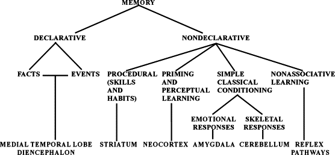

## Today's topics

- Biological basis of learning & memory
- Quiz 4
- Review Exam 3

## Coming up

- (Fun!) In-class lab next Tuesday
- Review for Exam 4 next Thursday
- Exam 4, Thursday 5/2, 4:40-6:30 pm in 112 Buckhout</red>

## Memory systems in the brain

[[@squire_memory_2004]](http://dx.doi.org/10.1016/j.nlm.2004.06.005)

## Review from last time

- Learning and memory involve changes in neural firing, circuitry
- Hebbian learning a type of associative learning
- NMDA receptor as coincidence detector
    + Molecular basis of one form of long-term potentiation (LTP)
- Different types of information stored in different brain systems

## Disorders of memory

## [Patient HM](http://www.pbs.org/wgbh/nova/body/corkin-hm-memory.html) (Henry G. Molaison)

- Intractable/untreatable epilepsy
- Bilateral resection of medial temporal lobe (1953)
- Epilepsy now treatable
- But, memory impaired
- Lived until 2008

## Brenda Milner tells the story

<iframe width="560" height="315" src="https://www.youtube.com/embed/JliczINA__Y" frameborder="0" allowfullscreen></iframe>

## HM's surgery

## Amnesia

- Acquired loss of memory
- ≠ normal forgetting
- Note: computers don't forget

## HM's amnesia

- Retrograde amnesia
    + Can’t remember 10 yrs before operation
    + Distant past better than more recent
- Severe, global anterograde amnesia
    + Impaired learning of new facts, events, people
- But, skills (mirror learning) intact
    
## Types of amnesia

- Retrograde ('backwards' in time)
    + Damage to information acquired pre-injury
    + Temporally graded
- Anterograde ('forward' in time) 
    + Damage to information acquired/experienced post-injury

## What it's like

*Every day is alone in itself, whatever enjoyment I’ve had, and whatever sorrow I’ve had…Right now, I’m wondering, have I done or said anything amiss?  You see at this moment, everything looks clear to me, but what happened just before?  That’s what worries me.  It’s like waking from a dream.  I just don’t remember.*

## What it's like

<iframe width="560" height="315" src="https://www.youtube.com/embed/Rq9eM4ZXRgs" frameborder="0" allowfullscreen></iframe>

<!-- Trailer for the film, 'Memento' -->
    
## Other causes of amnesia

- Disease 
    + Alzheimer’s, herpes virus
- [Korsakoff’s syndrome](https://en.wikipedia.org/wiki/Korsakoff%27s_syndrome)
    + Result of severe alcoholism
    + Impairs medial thalamus & mammillary bodies

## Patient NA

- Fencing accident
- Damage to medial thalamus
- Anterograde + graded retrograde amnesia
- Are thalamus & medial temporal region connected?

## Patient NA

<iframe width="420" height="315" src="https://www.youtube.com/embed/1GfFopZSyj8" frameborder="0" allowfullscreen></iframe>

## Spared skills in amnesia

- Skill-learning
- Mirror-reading, writing
- Short-term memory
- “Cognitive” skills
- Priming

## What does amnesia tell us?

- Long-term memory for facts, events, people 
- ≠ Short-term memory
- ≠ Long-term memory for “skills”
- Separate memory systems in the brain?

## Memory systems in the brain

[[@squire_memory_2004]](http://dx.doi.org/10.1016/j.nlm.2004.06.005)

## References {.smaller}
