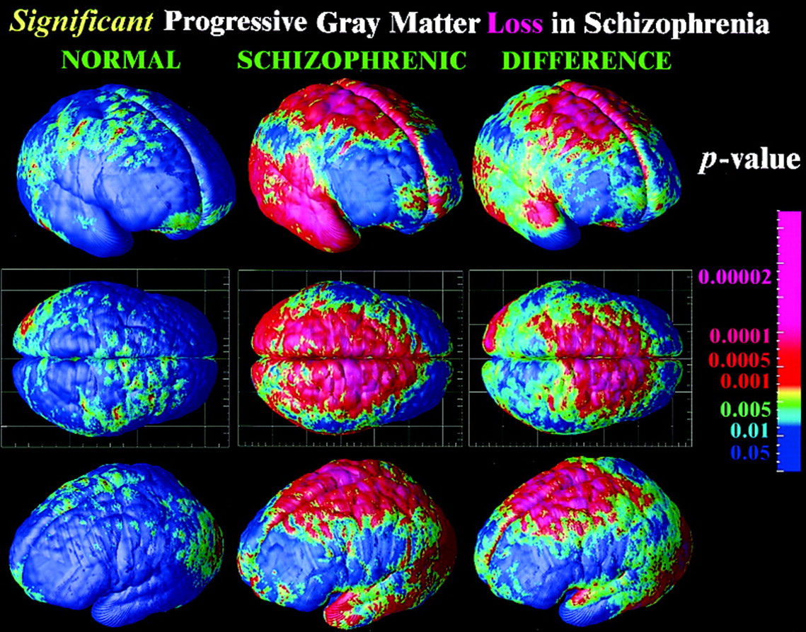

## Prelude

<iframe width="420" height="315" src="https://www.youtube.com/embed/-2GmzyeeXnQ" frameborder="0" allowfullscreen></iframe>

## Today's Topics

- Prevalence of mental illness
- Schizophrenia

## Mental illness lifetime prevalence

## Schizophrenia

<iframe width="420" height="315" src="https://www.youtube.com/embed/gGnl8dqEoPQ" frameborder="0" allowfullscreen></iframe>

## Simulating the Experience

<iframe width="420" height="315" src="https://www.youtube.com/embed/YXimT5CHCDE" frameborder="0" allowfullscreen></iframe>

## Overview

- Lifetime prevalence ~ 1/100
- ~1/3 chronic & severe
- Onset post-puberty, early adulthood
- Pervasive disturbance in mood, thinking, movement, action, memory, perception

## Screening (Yale PRIME test)

1. I think that I have felt that there are odd or unusual things going on that I can’t explain.
2. I think that I might be able to predict the future.
3. I may have felt that there could possibly be something interrupting or controlling my thoughts, feelings, or actions. 

<http://www.schizophrenia.com/sztest/primetest.pdf>

## Screening (continued)

5. I get confused at times whether something I experience or perceive may be real or may be just part of my imagination or dreams. 
6. I have thought that it might be possible that other people can read my mind, or that I can read other’s minds.
7. I wonder if people may be planning to hurt me or even may be about to hurt me.

## Historical background

- Bleuler
    + Introduced “schizophrenia” or “split mind”
    + Not multiple personality disorder
- Kraeplin
    + Dementia Praecox and Paraphrenia (1919)
    + Emphasized developmental and hereditary origins

## "Positive" symptoms

- “Additions” to behavior
- Disordered thought
- Delusions of grandeur, persecution
- Hallucinations (usually auditory)
- Bizarre behavior

## "Negative" symptoms

- “Reductions” in behavior
- Poverty of speech
- Flat affect
- Social withdrawal
- Impaired executive function
- Anhedonia (loss of pleasure)
- Catatonia (reduced movement)

## Cognitive symptoms

- Memory
- Attention
- Planning, decision-making
- Social cognition
- Movement

## Biological bases

- Genetic disposition
- Brain abnormalities
- Developmental origins

## Genetic disposition

## But, no single gene...

## Genes associated with schizophrenia at higher than chance levels

- *NOTCH4*, *TNF*: 
    - Part of major histocompatibility complex (MHC), cell membrane specializations involved in the immune system
- *DRD2* (dopamine D2 receptor), *KCNN3* (Ca+ activated K+ channel), *GRM3* (metabotropic glutatmate receptor)

[[@Johnson2017-bp]](http://doi.org/10.1016/j.biopsych.2017.06.033)

## Ventricles larger, esp in males

## Cause or effect? 

Ventricular enlargement increases across time [[@Kempton2010-ms]](http://doi.org/10.1016/j.schres.2010.03.036)

## Enlargement precedes diagnosis? {.smaller}

As in trajectories B or F

[[@Kempton2010-ms]](http://doi.org/10.1016/j.schres.2010.03.036)

## Hip and amygdala smaller

- Related to ventricular enlargement?
- Early disturbance in brain development?

---

[[@Van_Erp2015-ne]](http://doi.org/10.1038/mp.2015.63)

## [[@jiao_transmembrane_2017]](10.1073/pnas.1618213114)

- Dentate gyrus (DG) in hippocampus critical for spatial coding, learning and memory, and emotion processing. 
- DG dysfunction implicated in schizophrenia.
- Gene linked to schizophrenia, Transmembrane protein 108 (Tmem108) enriched in DG granule neurons
- Tmem108 expression increased during postnatal period critical for DG development.

## [[@jiao_transmembrane_2017]](10.1073/pnas.1618213114)

- Tmem108-deficient neurons form fewer and smaller spines. 
- Tmem108-deficient mice display schizophrenia-relevant behavioral deficits.

## Rapid gray matter loss in adolescents? {.smaller}

[[@thompson_mapping_2001]](http://dx.doi.org/10.1073/pnas.201243998)

<!-- Scrolling final reference page -->
<!-- http://stackoverflow.com/q/38260799 -->

## Widespread disruption in white matter connectivity

## White matter loss over age

[[@Kochunov2016-cu]](http://doi.org/10.1002/hbm.23336)

## Dopamine hypothesis

## Evidence for DA hypothesis

- DA (D2 receptor) antagonists (e.g. chlorpromazine)
    + improve positive symptoms
- *Typical antipsychotics* are DA D2 antagonists
- DA agonists
    + amphetamine, cocaine, L-DOPA
    + mimic or exacerbate symptoms
    
## Tardive Dyskinesia a side effect of DA antagonists

<video width="320" height="240" controls>
  <source src="http://2e.mindsmachine.com/ch/12/av/mm2e_1203_tardive_dyskinesia.mp4" type="video/mp4">
  Your browser does not support the video tag.
</video>

<https://2e.mindsmachine.com/ch/12/av/mm2e_1203_tardive_dyskinesia.mp4>

## Evidence against...

- New, *atypical antipsychotics* 
    + (e.g. Clozapine) INCREASE DA in frontal cortex, affect 5-HT
- Mixed evidence for high DA metabolite levels in CSF

## Glutamate hypothesis

- *Psychomimetic* drugs induce schizophrenia-like states
    + Phencyclidine (PCP), ketamine
    + NMDA receptor antagonists
- Schizophrenia == *underactivation* of NMDA receptors?
    - NMDA receptor role in learning, plasticity
    - DG neurons in [[@jiao_transmembrane_2017]](10.1073/pnas.1618213114) were glutamate-releasing.

## Schizophrenia summed up

- Wide-ranging disturbance of mood, thought, action, perception
- Broad changes in brain structure, function, chemistry, development
- ~~Dopamine hypothesis~~ giving way to glutamate hypothesis
- Genetic (polygenic = multiple genes) risk + environmental factors

## Early life stress increases risk

- Urban vs. rural living
- Exposure to infection *in utero*, other birth complications

## [[@levine_transgenerational_2016]](10.1016/j.schres.2016.06.019)

- Children (N=51,233) of parents who born during Nazi era (1922-1945)
- Emigrated before (indirect exposure) or after (direct exposure) to Nazi era
- Children exposed to direct stress of Nazi era *in utero* or postnatally
    + Did **not** differ in rates of schizophrenia, but
    + Had higher rehospitalization rates
    
## [[@debost_investigating_2015]](http://doi.org/10.1016/j.psyneuen.2015.05.013)

- Danish cohort (n=1,141,447)
- Exposure to early life stress 
    + *in utero* did **not** increase risk of schizophrenia, but
    + during 0-2 years increased risk
- Increased risk associated with an allele of a cortisol-related gene

## Next time...

- Emotion, happiness, and reward

## References {.smaller}