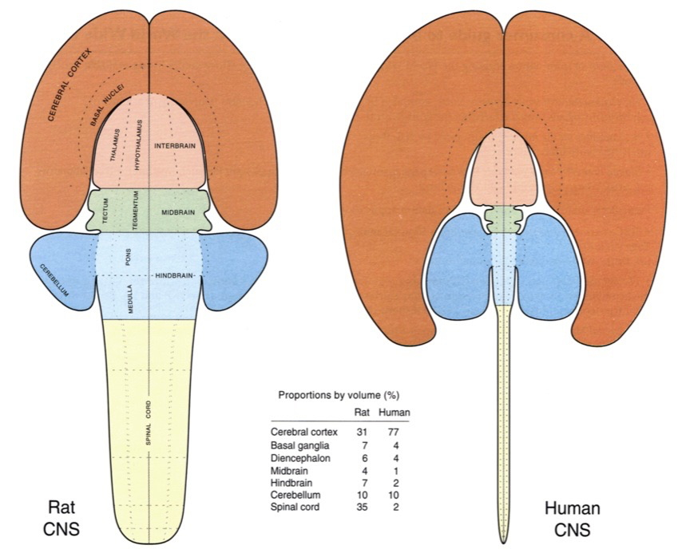

## Today's topics

- Quiz 1
- Wrap up on neuroanatomy

# Quiz 1

# Wrap up neuroanatomy
    
## Brodmann Areas

- [Korbinian Brodmann](https://en.wikipedia.org/wiki/Korbinian_Brodmann)
- Cytoarchitectonic differences in cerebral cortex

## Brodmann Areas

## Brodmann Areas

## Spinal cord

- Rostral/Caudal axis
    - Spinal column w/ vertebrae
    - Cervical (8), thoracic (12), lumbar (5), sacral (5), coccygeal (1)
    - Spinal segments & 31 nerve pairs 
    - *Cauda equina*, horse-tail like extension of axon fibers

## Spinal cord

## Spinal cord

- Organization of the spinal cord
    - Dorsal/Ventral
        + Dorsal root (sensory)
        + Ventral root (mostly motor)
    - Grey (interior) vs. white matter (exterior)
    
---

Spinal cord cross section diagram.

---

Spinal cord cross section.

## Organization of the PNS 

- Somatic division
- Autonomic division

- Cranial nerves
- Spinal nerves

## Cranial nerves

- Afferents (input), efferents (output), or mixed
- Innervate head and neck
- Olfactory (I), optic (II), (VIII) auditory,
vagus (X), etc. 
- Spinal nerves

## Cranial nerves

## Autonomic Nervous System (ANS)

- CNS & PNS components
- Controls "vegetative functions""
    + Limited voluntary control
- Two divisions
    + *Sympathetic*
    + *Parasympathetic* ('around' the sympathetic)
		
## ANS {.smaller}

## Sympathetic division

- Prepares body for action
- "Fight or flight""
- Spinal cord
    + ganglion chain along spinal column to End organs
- NTs
    + Preganglionic: ACh 
    + Post: NE

## Parasympathetic division

- Para -> "around"
- Restorative function
- "Rest & digest"
- Spinal cord -> ganglia near end organs -> end organ
    + NT: ACh
    
## Cajal/Swanson Architecture {.flexbox .vcenter}

---

[Swanson, 2005](http://dx.doi.org/10.1002/cne.20733)

---

## Next time...

- Cells of the nervous system

## References {.smaller}
