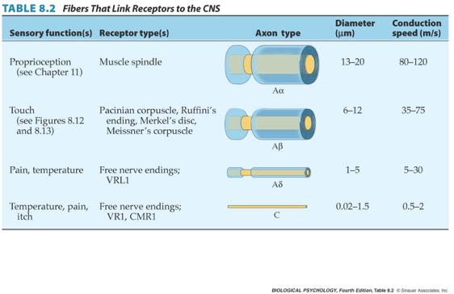

## Today's Topics

- Exam 3 next Thursday, April 11
- Warm-up
- Wrap-up on the neuroscience of action

# Warm-up

## Which of the following sensory questions is the purview of *exteroceptive* systems?

- Do I have a fever?
- Is it warm enough outside to play frisbee?
- Am I hungry?
- Am I tired?

## Which of the following sensory questions is the purview of *exteroceptive* systems?

- Do I have a fever?
- **Is it warm enough outside to play frisbee?**
- Am I hungry?
- Am I tired?

## Which of the following would *not* be useful in measuring a neuron's receptive field?

- Recording from the neuron
- Stimulating the skin/retina/cochlea with different patterns & intensities
- Characterizing the stimulation patterns that change responses
- Using fMRI to record from sensory cortex

## Which of the following would *not* be useful in measuring a neuron's receptive field?

- Recording from the neuron
- Stimulating the skin/retina/cochlea with different patterns & intensities
- Characterizing the stimulation patterns that change responses
- **Using fMRI to record from sensory cortex**

## The flow of calcium ($Ca^{++}$) ions into the cell affects which of the following:

1. The exocytosis of neurotransmitter
2. The contraction of muscle fiber
3. Neurotransmitter reuptake
4. both 1. and 2.

## The flow of calcium ($Ca^{++}$) ions into the cell affects which of the following:

1. The exocytosis of neurotransmitter
2. The contraction of muscle fiber
3. Neurotransmitter reuptake
4. **both 1. and 2.**

# Neuroscience of action

## Muscle contraction

<iframe width="560" height="315" src="https://www.youtube.com/embed/ousflrOzQHc" frameborder="0" allow="accelerometer; autoplay; encrypted-media; gyroscope; picture-in-picture" allowfullscreen></iframe>

## Muscles are sensory organs, too!

It may surprise you to learn that muscles are both action-producers and sensory organs. The consequence of this is that there are muscle control systems that work quickly using short pathways of only one or a few synapses involving the spinal cord. These let us do things like balance plates full of food without spilling them.

## Two muscle fiber types

A muscle's sensory signals come from a special type of muscle fiber that does not produce force. These sensorymotor fibers are surrounded by force-producing motor fibers. The sensory motor fibers have both an input that causes them to contract and an output that senses the state of the muscle.

## Two muscle fiber types

- Intrafusal fibers
    + Sense length/tension
    + Contain muscle spindles linked to Ia afferents
    + ennervated by gamma ($\gamma$) motor neurons
- Extrafusal fibers
    + Generate force
    + ennervated by alpha ($\alpha$) motor neurons
    

The two muscle fiber types are called *intrafusal* and *extrafusal*. The intrafusal fibers sense changes in the length and tension of the muscle. They signal changes in length and tension via Ia afferent fibers. The control of intrafusal fiber contraction is due to gamma motor neurons. The extrafusal fibers generate force. They have no sensory afferents. They contract when activated by alpha motor neurons.

  
## Monosynaptic stretch (myotatic) reflex

- Muscle stretched (length increases)
- Muscle spindle in intrafusal fiber activates
- Ia afferent sends signal to spinal cord
    + Activates alpha ($\alpha$) motor neuron
- Muscle contracts, shortens length

A simple, single-synapse or monosynaptic, reflex shows how these work in practice. 

## Monosynaptic stetch (myotatic) reflex

- Gamma ($\gamma$) motor neuron fires to take up intrafusal fiber slack

Note that after the alpha motor neurons have fired and the extrafusal fibers have contracted, there is slack in the intrafusal fibers (at right). That's where the gamma motor neuron comes in. It fires to make the intrafusal fiber contract and take up the slack. Without this, the stretch receptor system wouldn't be able to detect changes in muscle length continuously.

---

Dr. Gilmore used to go rock climbing. If you've done any rock climbing, you know that there is a safety system called "belaying". The "belayer" is sort of like the intrafusal muscle fiber. The belayer doesn't want there to be much slack in the rope to the climber or else a fall could result in an injury. So, the belayer adjusts the amount of slack in the rope.

## Monosynaptic stretch (myotatic) reflex

The intrafusal and extrafusal fibers work together to create the monosynaptic stretch reflex. It's what keeps the server's tray level.
The Ia sensory afferent detects stretch in the bicep muscle, makes a single synapse on the $\alpha$ motor neuron for the bicep, and restores the muscle extrafusal length. Separately, the $\gamma$ neuron fires and contracts the intrafusal fiber.

## Why doesn't antagonist muscle respond?

The problem is that most muscles are organized in agonist/antagonist pairs. So, contracting the bicep stretches the tricep. If that triggered the tricep's stretch reflex, the two muscles could find themselves fighting against one another to control the arm's position.

## Why doesn't antagonist muscle respond?

- Polysynaptic inhibition of antagonist muscle
- Prevents/dampens tremor

In practice, this doesn't happen because there is a *polysynaptic* connection from the stretch receptor that *inhibits* the antagonist muscle. So, the bicep's stretch receptor inhibits the extrafusal fibers in the tricep and vice versa. 

## Brain gets fast(est) sensory info from spindles

Curiously enough, the axons conveying muscle spindle/stretch receptor activity are the largest in diameter and most heavily myelinated axons in your body. They also conduct the fastest. So, your brain gets proprioceptive information about the length/stretch of your muscles faster than any other input. Faster even than touch or pain.

## How the brain controls the muscles

- Pyramidal tracts
    + Pyramidal cells (Cerebral Cortex Layer 5) in primary motor cortex (M1)
    + Corticobulbar (cortex -> brainstem) tract
    + Corticospinal (cortex -> spinal cord) tract
- Crossover (decussate) in medulla
    + L side of brain ennervates R side of body
    

How does the brain control the muscles? One way is through the pyramidal tracts that originate in *pyramidal* shaped neurons in layer 5 of primary motor cortex. Whether projecting to the brainstem to control the head or neck or the spinal cord to control the body, these fibers cross the midline at the medulla. So, that the left cerebral cortex controls the right side of the body and vice versa.

   
    
## Corticospinal tract

<https://commons.wikimedia.org/wiki/File:Gray764.png#/media/File:Gray764.png>

    
## How the brain controls the muscles

- Extrapyramidal system
    + Tectospinal tract
    + Vestibulospinal tract
    + Reticulospinal tract
- Involuntary movements
    + Posture, balance, arousal
    

*Involuntary* motor behavior is controlled by a separate "extrapyramidal" system. These systems control posture, balance, and overall arousal. They originate in the tectum/superior colliculus, in the vestibular system, and in the brainstem's reticular formation.

    
## Extrapyramidal system

<https://upload.wikimedia.org/wikipedia/commons/b/be/Gray672.png>

This figure shows that the descending motor pathways in red on the right have their own spatial organization depending on where they originate in the brain.

## Disorders

- Parkinson's
- Huntington's

Ok, let's switch to talking about disorders of the motor system. We'll start with a short video about Parkinson's.

## The Faces of Parkinson's

<iframe width="560" height="315" src="https://www.youtube.com/embed/CqEwPqUO1Bw" frameborder="0" allowfullscreen></iframe>

## Parkinson's

- Slow, absent movement, resting tremor
- Cognitive deficits, depression
- DA Neurons in substantia nigra degenerate
- Treatments
    + DA agonists
    + DA agonists linked to impulse control disorders in ~1/7 patients [[@ramirez-zamora_treatment_2016]](http://dx.doi.org/10.1586/14737175.2016.1158103)
    + Levodopa (L-Dopa), DA precursor
    

The symptoms of Parkinson's include motor deficits and cognitive and affective symptoms. The disease is associated with degeneration in dopamine releasing neurons in the substantia nigra. Treatments include dopamine agonists, which have side effects, and Levodopa, a metabolic precursor for dopamine.

<!-- ## Awakenings -->

<!-- 
 -->
<!-- <a src="https://en.wikipedia.org/wiki/Awakenings"> -->
<!--  -->
<!-- </a> -->
<!-- 
 -->

## Huntington's

<http://cp91279.biography.com/1000509261001/1000509261001_1733824754001_woody-guthrie-centennial-1.jpg>

The second disorder of movement we'll discuss is Huntington's. The folk singer Woody Guthrie and his mother died of the disease.

## Huntington's

- Formerly Huntington’s Chorea
    + "Chorea" from Greek for "dance"
    + “Dance-like” pattern of involuntary movements
- Cognitive decline
- Genetic + environmental influences
- Disturbance in striatum
- No effective treatment

This disease used to be called Huntington's Chorea because of the dance-like pattern of involuntary movements that were a symptom. Like Parkinson's it has cognitive symptoms and is associated with neurodegeneration in the basal ganglia.  It is a genetic condition that can be detected, but for which there is no effective treatment or cure. Let's watch a video about Huntington's.

## Huntington's

<iframe width="560" height="315" src="https://www.youtube.com/embed/HBLrY_nXU_U" frameborder="0" allowfullscreen></iframe>

## Final thoughts

- Control of movement determined by multiple sources
- Cerebral cortex + basal ganglia + cerebellum + spinal circuits

<!-- ## Multiple, parallel controllers -->

<!-- 
 -->
<!--  -->
<!-- 
 -->

<!-- ## Cerebellum as predictor of future sensory states? [[@ito_control_2008]](10.1038/nrn2332) {.smaller} -->

<!-- 
 -->
<!--  -->

<!-- <http://venturebeat.com/wp-content/uploads/2009/10/star-trek-holodeck.jpg> -->
<!-- 
 -->

## Next time...

- Vision

## References {.smaller}
